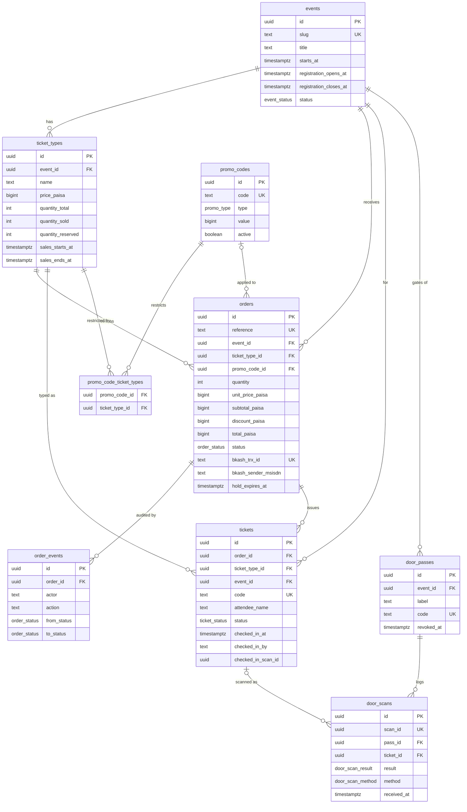
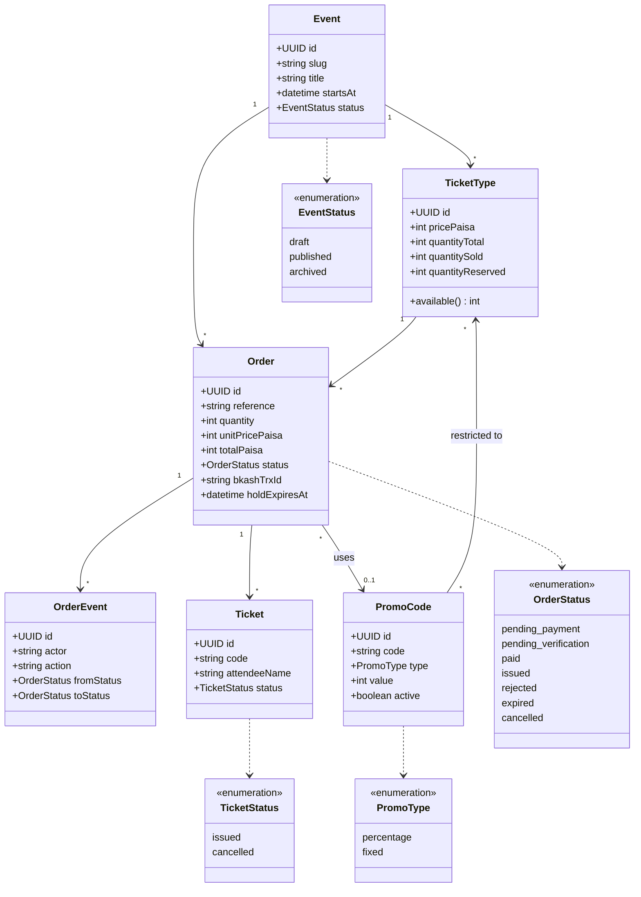
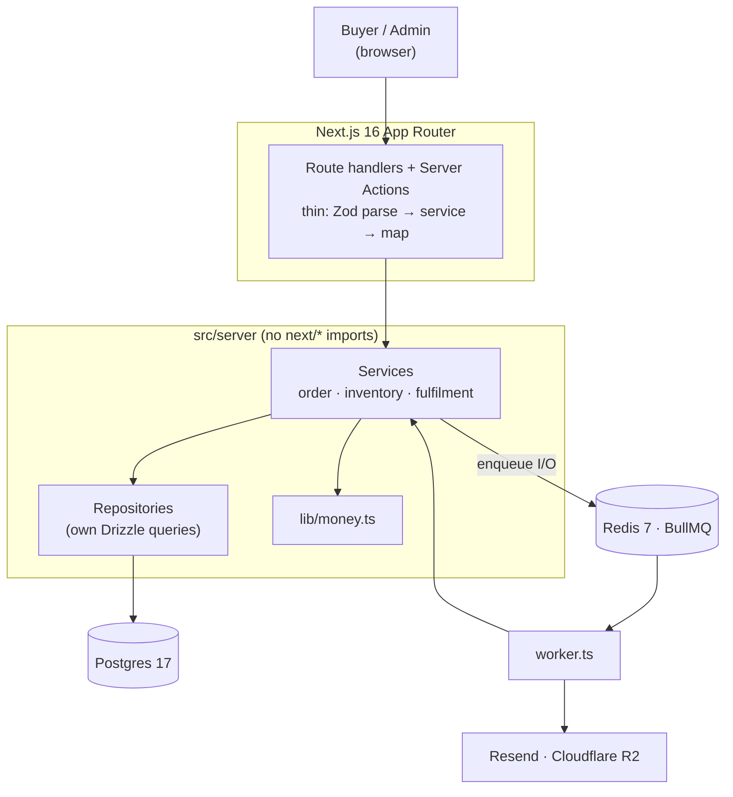
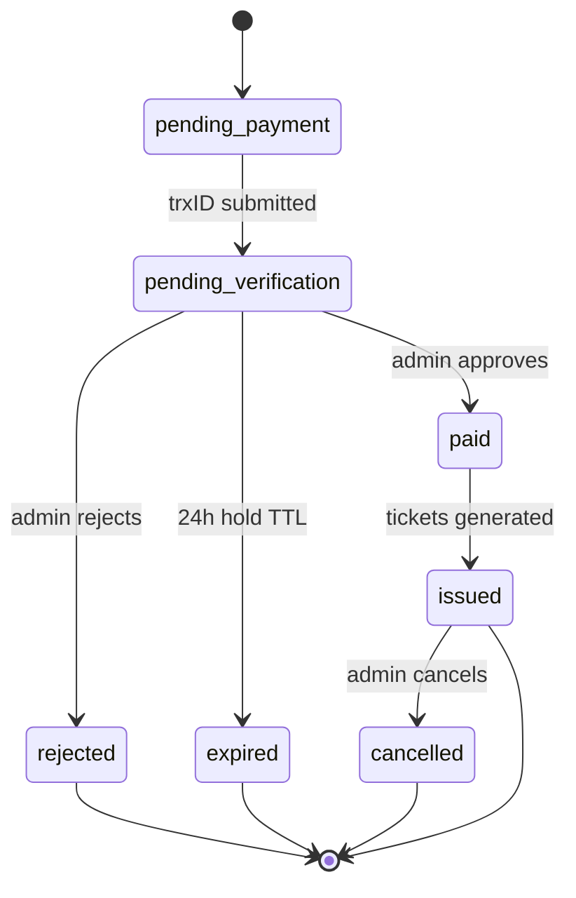
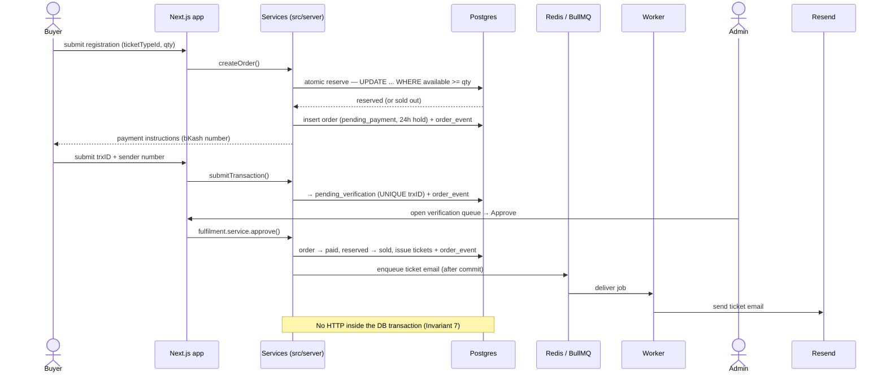

# Diagrams

Status: ACTIVE · Owner: unassigned · Last updated: 2026-09-15

Visual models of the data, domain, architecture, and core flows. These render
natively on GitHub. See [ARCHITECTURE.md](ARCHITECTURE.md) for the narrative and
[../CLAUDE.md](../CLAUDE.md) for the invariants they encode.

---

## 1. Entity–relationship (database)

Money is `bigint` paisa (Invariant 1); `orders.bkash_trx_id` is UNIQUE
(Invariant 3); `ticket_types` carries a CHECK that
`quantity_total − quantity_sold − quantity_reserved >= 0` (Invariant 2 backstop).

---

## 2. Domain model (class diagram)

---

## 3. Architecture (component layers)

The worker is a separate Node process that imports the same services directly —
which is why nothing in `src/server/**` may import `next/*`. All network I/O
(email, R2) is queued, never done inside a DB transaction (Invariant 7).

---

## 4. Order lifecycle (state machine)

Inventory is held on order creation and released on `rejected` or `expired`.
Every transition writes an append-only `order_events` row (Invariant 6), and only
`fulfilment.service.ts` performs the `paid → issued` step (Invariant 4).

---

## 5. Registration → payment → fulfilment (sequence)

