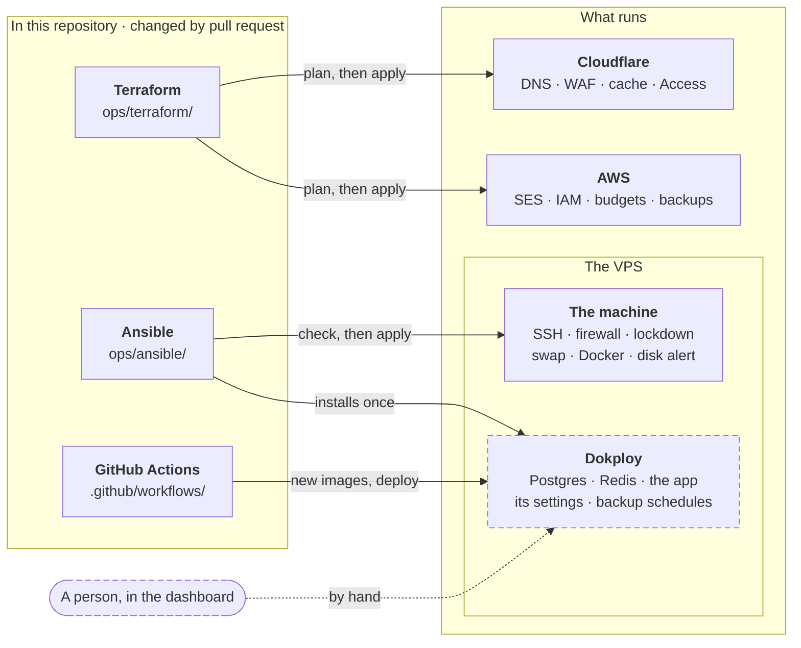

# ADR-063 — The server as code: Ansible, checked before it changes

**Date:** 2026-10-06 · **Status:** Accepted

**Context:** The production server was set up by hand over SSH, in 21
steps that [SERVER.md](../infra/SERVER.md) records one by one. Terraform
(ADR-062) made the Cloudflare and AWS accounts code, but not the machine:
there is no BengalCloud provider, and Terraform describes resources, not
the inside of an operating system. So a lost server meant an hours-long
runbook typed from a document, a change could not be previewed before it
happened, and a setting changed by hand stayed invisible until something
broke. The server is about to be resized in place (Phase 9.5), and a
staging server (9.7) must come out exactly like production.

**Decision:**

- **Ansible owns the machine**, in `ops/ansible/`. One role per SERVER.md
  section, and each role names its section. Ansible logs in over the SSH
  alias we already use; nothing is installed on the server for it.
- **Pinned exactly:** `ansible-core` 2.21.5 and `ansible-lint` 26.9.0,
  installed by `uv` into the folder's own virtual environment from
  `uv.lock`; collections `ansible.posix` 2.2.2 and `community.general`
  13.5.0.
- **Three gates before production changes:**
  1. `ansible-lint` with its strictest profile, `production`.
  2. The lab: a local VM sized like production (Multipass, Ubuntu 24.04)
     with snapshots. The whole playbook runs twice, and the second run
     must change nothing.
  3. Check mode against production (`--check --diff`), read line by
     line. It changes nothing, like `terraform plan`.
- **Applied by a person, from the laptop**, who first types the server's
  name. CI only lints; it never holds a credential or logs in.
- **Adopted in place, like an import.** Every role first ran against the
  live server in check mode and had to report `changed=0`: the code was
  proven to describe the real server before it was allowed to change it.
- **Secrets never enter the repository.** They are read from `.env` at
  run time (Bitwarden is the source), and written with `no_log` and no
  diff, so they never reach the screen, CI or logs.
- **Four hard lines:**
  - Docker is never restarted by Ansible: a restart stops the site. A
    change that needs one prints a reminder to do it at a quiet time.
  - A file Dokploy owns is never edited. Traefik's `traefik.yml` is only
    checked for our two hand edits.
  - Dokploy is installed once, with its own install script kept in the
    repository as reviewed and pinned by checksum, and never upgraded:
    it updates itself from its dashboard.
  - The origin lockdown is enabled before Docker exists, so its rules
    are in place before any port is published, the Dokploy dashboard's
    port 3000 included.

The four tools that own the infrastructure, and where each one's job
ends:

Dashed: changed by hand.

**Out of scope** (manual, recorded in SERVER.md): everything inside
Dokploy, which keeps it in its own database (the owner account, the
projects, Postgres and Redis, the compose app and its environment, the
backup schedules); Traefik's two hand edits; the app's database role,
which needs the database password; the VPS itself, ordered in the
provider's panel.

**Consequences:**

- Rebuilding the server is one command and a short list of manual steps
  (SERVER.md → Rebuilding from scratch). Rehearsed on 2026-10-06 on the
  lab from a blank Ubuntu: 7 minutes 23 seconds to a running Dokploy.
- Drift shows up: a check that reports changes nobody made in code.
- A change to the server takes longer (lab, check, review). On purpose.
- A setting changed by hand over SSH must be copied into its role the
  same day, or the next apply puts the old value back.
- A second toolchain, Python through `uv`, next to Node.
- The lab runs ARM (Apple silicon) while production is x86. The roles
  don't depend on it, and production check mode is the final word.

**Rejected:**

- **A shell script.** It runs once from the top. Making every step safe
  to repeat means a hand-written guard per step, and it cannot show what
  it would change before changing it.
- **cloud-init.** It runs at first boot only, so it can neither check nor
  change a running server.
- **Terraform provisioners** (`remote-exec`). HashiCorp calls them a last
  resort: no repeat safety and no preview. And there is no BengalCloud
  provider to attach them to.
- **A golden image** (Packer). A way to build a new server, not to check
  or change the running one, and one more pipeline to keep.
- **NixOS.** The whole machine declared as code, but it means
  reinstalling the server and learning Nix. Ubuntu 24.04 LTS stays.
- **Chef, Puppet, Salt.** An agent or a control server, for one machine.
- **Ansible Vault.** A second home for secrets with its own password;
  Bitwarden and `.env` already do this.
- **AWX or Semaphore.** A web interface for Ansible that needs its own
  server and hardening, for one operator.
