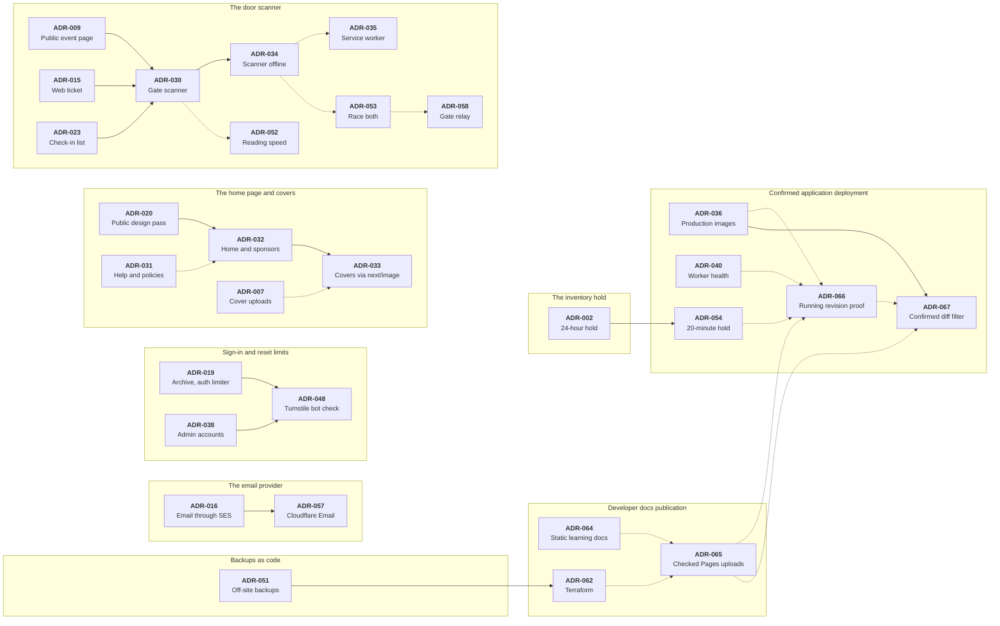

# Architecture decision records

An architecture decision record (ADR) is a short note about one choice that
shaped this system: the problem, what was chosen, and what it costs. The
code shows what the system does. An ADR keeps why, so nobody undoes a
choice without knowing the reason, or argues it again from the start.

There is one file per decision, numbered in the order the decisions were
made. A record is never deleted or rewritten. When a later decision changes
an earlier one, the earlier record is marked and links to the later one.

## Reading an ADR

Each file starts with a few fields:

| Field        | What it holds                                                     |
| ------------ | ----------------------------------------------------------------- |
| `id`         | `ADR-` and a three-digit number, in the order decisions were made |
| `title`      | The decision, in a few words                                      |
| `date`       | The day it was decided                                            |
| `status`     | `accepted`, `partly-superseded` or `superseded` (see below)       |
| `area`       | The part of the system it is about: one of the tables below       |
| `supersedes` | Earlier ADRs this one replaces, in whole or in part               |
| `extends`    | Earlier ADRs this one builds on; they still stand                 |

Then the record, in the same parts every time:

- **Context:** the problem, and what forced a choice.
- **Decision:** what was chosen.
- **Consequences:** what it costs, and what it makes easier.
- **Revisit when:** the change that should reopen it.

Many ADRs also list what was **Rejected**, and why.

The status is one of three:

| Status            | Meaning                                                                                 |
| ----------------- | --------------------------------------------------------------------------------------- |
| Accepted          | In force. The code follows it.                                                          |
| Partly superseded | A later ADR replaced part of it. The rest is in force; the ADR says which part changed. |
| Superseded        | A later ADR replaced all of it. Kept as the record of what came before.                 |

## How decisions build on each other

Most ADRs stand alone. These are the ones a later ADR changed or built on,
grouped by the story they tell. Time runs left to right: each arrow points
from an older ADR to the later one.

- **Solid arrow:** the later ADR replaced part of the older one. Only
  ADR-002 was replaced in full.
- **Dotted arrow:** the later ADR builds on the older one, which still
  stands.

## Decisions by area

### Payments and orders

| ADR | Decision                                                                                                                              | Status                                                    | Date       |
| --- | ------------------------------------------------------------------------------------------------------------------------------------- | --------------------------------------------------------- | ---------- |
| 001 | [Manual bKash verification instead of API integration](001-manual-bkash-verification.md)                                              | Accepted                                                  | 2026-08-21 |
| 002 | [24-hour inventory hold](002-24-hour-inventory-hold.md)                                                                               | Superseded by [ADR-054](054-inventory-hold-20-minutes.md) | 2026-08-21 |
| 011 | [Inventory primitives: three conditional UPDATEs with an injectable executor](011-inventory-primitives.md)                            | Accepted                                                  | 2026-09-19 |
| 012 | [Order creation: one transaction, prices from the row, uuid URLs, attendee names on the order](012-order-creation.md)                 | Accepted                                                  | 2026-09-19 |
| 013 | [Payment submission and the expiry worker](013-payment-submission-and-expiry.md)                                                      | Accepted                                                  | 2026-09-19 |
| 014 | [Fulfilment: approve is one transaction to `issued`, email hooks after commit, rejection reasons on the order](014-fulfilment.md)     | Accepted                                                  | 2026-09-19 |
| 024 | [Cancel ticket: a fourth inventory primitive, order locks are NO KEY UPDATE, the last ticket cancels the order](024-cancel-ticket.md) | Accepted                                                  | 2026-09-21 |
| 027 | [Promo codes (B10): per-ticket discount, priced only on the server, refused rather than dropped](027-promo-codes.md)                  | Accepted                                                  | 2026-09-23 |
| 028 | [Complimentary tickets (B13): a ৳0 order born `issued`, inside fulfilment; seats, not sales](028-complimentary-tickets.md)            | Accepted                                                  | 2026-09-23 |
| 054 | [Inventory hold: 20 minutes on a visible clock, a 2-minute grace](054-inventory-hold-20-minutes.md)                                   | Accepted                                                  | 2026-10-04 |

### Tickets and email

| ADR | Decision                                                                                                             | Status                                                          | Date       |
| --- | -------------------------------------------------------------------------------------------------------------------- | --------------------------------------------------------------- | ---------- |
| 015 | [The web ticket: code as access key, on-demand PDF, rename until close, a QR without a scanner](015-web-ticket.md)   | Partly superseded by [ADR-030](030-gate-scanner-slice-a.md)     | 2026-09-19 |
| 016 | [Transactional email: SES behind a Mailer port, sent by the worker, audited per message](016-transactional-email.md) | Partly superseded by [ADR-057](057-cloudflare-email-service.md) | 2026-09-20 |
| 017 | [Buyer access: one name per order, Find my order, optional passwordless accounts](017-buyer-access.md)               | Accepted                                                        | 2026-09-20 |
| 039 | [SES feedback: SNS on the identity, not a configuration set; VDM and Auto Validation off](039-ses-feedback.md)       | Accepted                                                        | 2026-09-28 |
| 057 | [Email through Cloudflare Email Service; SES becomes the rollback](057-cloudflare-email-service.md)                  | Accepted                                                        | 2026-10-04 |

### Gate scanner

| ADR | Decision                                                                                                                     | Status                                                      | Date       |
| --- | ---------------------------------------------------------------------------------------------------------------------------- | ----------------------------------------------------------- | ---------- |
| 030 | [Gate scanner (Slice A): gate passes, one atomic check-in, a self-hosted decoder](030-gate-scanner-slice-a.md)               | Partly superseded by [ADR-034](034-gate-scanner-offline.md) | 2026-09-24 |
| 034 | [Gate scanner offline (Slice B): a hashed list, an outbox, double entries shown not prevented](034-gate-scanner-offline.md)  | Accepted                                                    | 2026-09-26 |
| 035 | [Gate scanner Slice B2: a service worker so /door reloads without signal](035-gate-scanner-service-worker.md)                | Accepted                                                    | 2026-09-26 |
| 052 | [Gate scanner reading speed: the phone's own reader first, a centre crop for WebAssembly](052-gate-scanner-reading-speed.md) | Accepted                                                    | 2026-10-04 |
| 053 | [Gate scanner "race both": the phone's list answers ADMIT in 0.4 s; gates share check-ins](053-gate-scanner-race-both.md)    | Accepted                                                    | 2026-10-04 |
| 058 | [Gate relay: door phones share check-ins through a Cloudflare room, live and without our server](058-gate-relay.md)          | Accepted                                                    | 2026-10-05 |
| 059 | [Gate scanner pre-doors test: six checks on each phone, never a lock](059-gate-scanner-pre-doors-test.md)                    | Accepted                                                    | 2026-10-05 |

### Admin

| ADR | Decision                                                                                                                        | Status                                                      | Date       |
| --- | ------------------------------------------------------------------------------------------------------------------------------- | ----------------------------------------------------------- | ---------- |
| 006 | [Event status: transition table, readiness check, conditional UPDATE](006-event-status.md)                                      | Accepted                                                    | 2026-09-18 |
| 007 | [Cover images: presigned direct uploads, keys not URLs, MinIO locally](007-cover-image-uploads.md)                              | Accepted                                                    | 2026-09-18 |
| 008 | [Admin UI: light-only tokens, URL-state editor tabs, honest roadmap nav](008-admin-ui.md)                                       | Accepted                                                    | 2026-09-18 |
| 010 | [Event description: rich text stored as allowlisted HTML in the same column](010-event-description-rich-text.md)                | Accepted                                                    | 2026-09-18 |
| 021 | [Orders list (B9): normalised search, URL state, CSV as a route handler](021-orders-list.md)                                    | Accepted                                                    | 2026-09-21 |
| 022 | [Admin data table: TanStack Table in server-controlled mode; status totals](022-admin-data-table.md)                            | Accepted                                                    | 2026-09-21 |
| 023 | [Check-in list (B11): unpaginated in-memory list, a separate print sheet, partial lists label themselves](023-check-in-list.md) | Partly superseded by [ADR-030](030-gate-scanner-slice-a.md) | 2026-09-21 |
| 025 | [Settings (B14): one typed row, env as the fallback, read per request and per email job](025-settings.md)                       | Accepted                                                    | 2026-09-21 |
| 026 | [Sales report (B12): read-only aggregates, the audit trail is the clock, B9's money vocabulary reused](026-sales-report.md)     | Accepted                                                    | 2026-09-22 |

### Public site

| ADR | Decision                                                                                                                                              | Status                                                           | Date       |
| --- | ----------------------------------------------------------------------------------------------------------------------------------------------------- | ---------------------------------------------------------------- | ---------- |
| 009 | [Public event page: phase as a pure function, archived pages stay live, OG from server metadata, e2e on a production build](009-public-event-page.md) | Partly superseded by [ADR-030](030-gate-scanner-slice-a.md)      | 2026-09-18 |
| 018 | [Static pages: copy in TSX, contact from env, a native accordion](018-static-pages.md)                                                                | Accepted                                                         | 2026-09-20 |
| 019 | [Archive read model, error reference from Next's digest, auth limiter off only in e2e](019-archive-and-error-reference.md)                            | Partly superseded by [ADR-048](048-bot-check-turnstile.md)       | 2026-09-21 |
| 020 | [Public design pass to the approved canvas](020-public-design-pass.md)                                                                                | Partly superseded by [ADR-032](032-home-navigation-sponsors.md)  | 2026-09-21 |
| 029 | [Private venue: stripped from the public read models, revealed to ticket holders](029-private-venue.md)                                               | Accepted                                                         | 2026-09-23 |
| 031 | [Help & policies (Canvas 5): content as data, repo copy wins, an accessible focus ring](031-help-and-policies.md)                                     | Accepted                                                         | 2026-09-25 |
| 032 | [Home, navigation & sponsors (Canvas 6): logos through the server, one offer rule, a path-aware header](032-home-navigation-sponsors.md)              | Partly superseded by [ADR-033](033-covers-through-next-image.md) | 2026-09-25 |
| 042 | [Discoverability: structured data, sitemap, robots, a generated share image](042-discoverability.md)                                                  | Accepted                                                         | 2026-09-29 |
| 055 | [Per-event option to hide how many tickets are left](055-hide-tickets-left.md)                                                                        | Accepted                                                         | 2026-10-04 |

### Localisation

| ADR | Decision                                                                                | Status   | Date       |
| --- | --------------------------------------------------------------------------------------- | -------- | ---------- |
| 060 | [12-hour time for people, ASCII digits for checks](060-12-hour-time-ascii-digits.md)    | Accepted | 2026-10-05 |
| 061 | [Bangla at /bn: a proxy rewrite, a switch, and formatters by hand](061-bangla-at-bn.md) | Accepted | 2026-10-05 |

### Security and auth

| ADR | Decision                                                                                                       | Status                                                     | Date       |
| --- | -------------------------------------------------------------------------------------------------------------- | ---------------------------------------------------------- | ---------- |
| 037 | [The visitor's IP behind Cloudflare: read X-Forwarded-For from the right](037-visitor-ip-behind-cloudflare.md) | Accepted                                                   | 2026-09-28 |
| 038 | [Admin accounts: change password, forgot password, change email](038-admin-accounts.md)                        | Partly superseded by [ADR-048](048-bot-check-turnstile.md) | 2026-09-28 |
| 043 | [Security headers and a nonce Content-Security-Policy](043-security-headers-csp.md)                            | Accepted                                                   | 2026-09-29 |
| 044 | [A least-privilege database role for the app](044-least-privilege-db-role.md)                                  | Accepted                                                   | 2026-09-29 |
| 045 | [Only Cloudflare reaches the origin](045-only-cloudflare-reaches-origin.md)                                    | Accepted                                                   | 2026-09-29 |
| 046 | [Limits on placing orders: two open per phone, twenty per network](046-order-limits.md)                        | Accepted                                                   | 2026-09-30 |
| 048 | [Bot check: Cloudflare Turnstile on the public forms](048-bot-check-turnstile.md)                              | Accepted                                                   | 2026-10-02 |
| 049 | [Admin two-factor sign-in: authenticator app, backup codes, no shortcuts](049-admin-two-factor.md)             | Accepted                                                   | 2026-10-02 |
| 050 | [Cloudflare Access in front of the admin area and Dokploy](050-cloudflare-access.md)                           | Accepted                                                   | 2026-10-03 |

### Performance

| ADR | Decision                                                                                                                        | Status   | Date       |
| --- | ------------------------------------------------------------------------------------------------------------------------------- | -------- | ---------- |
| 033 | [Event covers through `next/image`: the allow-list from `R2_PUBLIC_URL`, sized per placement](033-covers-through-next-image.md) | Accepted | 2026-09-26 |
| 047 | [Load shedding: a cap on requests in flight, and a rate limit per address](047-load-shedding.md)                                | Accepted | 2026-09-30 |
| 056 | [Public pages cached at the Cloudflare edge for 30 seconds, anonymous visitors only](056-edge-cache.md)                         | Accepted | 2026-10-04 |

### Infrastructure and deploys

| ADR | Decision                                                                                                     | Status                                                                     | Date       |
| --- | ------------------------------------------------------------------------------------------------------------ | -------------------------------------------------------------------------- | ---------- |
| 036 | [Deployment: Dokploy on one VPS, images built in CI, pull-only deploys](036-deployment-dokploy.md)           | Partly superseded by [ADR-067](067-confirmed-baseline-deploy-filtering.md) | 2026-09-27 |
| 040 | [Monitoring: an outside check, one alert group, a worker heartbeat](040-monitoring.md)                       | Accepted                                                                   | 2026-09-28 |
| 051 | [Off-site backup copy in AWS S3, and hourly backups during an event's sales window](051-off-site-backups.md) | Partly superseded by [ADR-062](062-terraform.md)                           | 2026-10-03 |
| 062 | [Terraform for Cloudflare and AWS: imported, never recreated; no secrets in state](062-terraform.md)         | Accepted                                                                   | 2026-10-05 |
| 063 | [The server as code: Ansible, checked before it changes](063-server-as-code-ansible.md)                      | Accepted                                                                   | 2026-10-06 |
| 065 | [Publish tested static docs through a separate Pages uploader](065-docs-publication.md)                      | Accepted                                                                   | 2026-10-07 |
| 066 | [Confirm the running web and worker revision after deploying](066-confirmed-app-deployments.md)              | Accepted                                                                   | 2026-10-08 |
| 067 | [Skip application deploys from a confirmed non-runtime diff](067-confirmed-baseline-deploy-filtering.md)     | Accepted                                                                   | 2026-10-08 |

### Code structure and tooling

| ADR | Decision                                                                                                         | Status   | Date       |
| --- | ---------------------------------------------------------------------------------------------------------------- | -------- | ---------- |
| 003 | [Adopt latest major versions at scaffold time](003-latest-major-versions.md)                                     | Accepted | 2026-09-15 |
| 004 | [Auth instance lives outside `src/server/`](004-auth-outside-server.md)                                          | Accepted | 2026-09-15 |
| 005 | [Service/repository shape: factories, a composition root, typed domain errors](005-service-repository-shape.md)  | Accepted | 2026-09-16 |
| 041 | [The repository: public and proprietary, merge commits, versions as milestones](041-the-repository.md)           | Accepted | 2026-09-29 |
| 064 | [Developer docs: static Fumadocs, source-linked learning, and selective interaction](064-developer-docs-site.md) | Accepted | 2026-10-07 |

## Adding an ADR

Write one when a choice is not obvious from the code, or would be
questioned later: a rule the code must keep, a trade-off, one tool picked
over another. A routine change does not need one.

1. Copy [TEMPLATE.md](TEMPLATE.md) to `NNN-short-slug.md`, where `NNN` is
   one more than the highest number in this folder.
2. Fill in the fields and the record. Keep it short, and link the code and
   docs it touches.
3. Add a row to its area's table above.
4. If it changes or builds on earlier ADRs, list them in `supersedes` or
   `extends`, and add the arrows to the diagram. For each ADR it
   supersedes, also update that older file: set its `status`, and say
   under its heading which part changed, with a link to the new ADR. Then
   update its row above.
5. Run `pnpm test`. `tests/unit/adr-files.test.ts` checks the fields, the
   numbering, this index, the diagram and the links.
