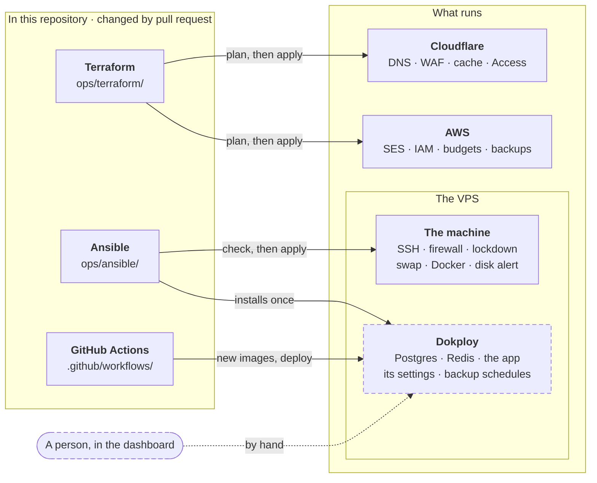
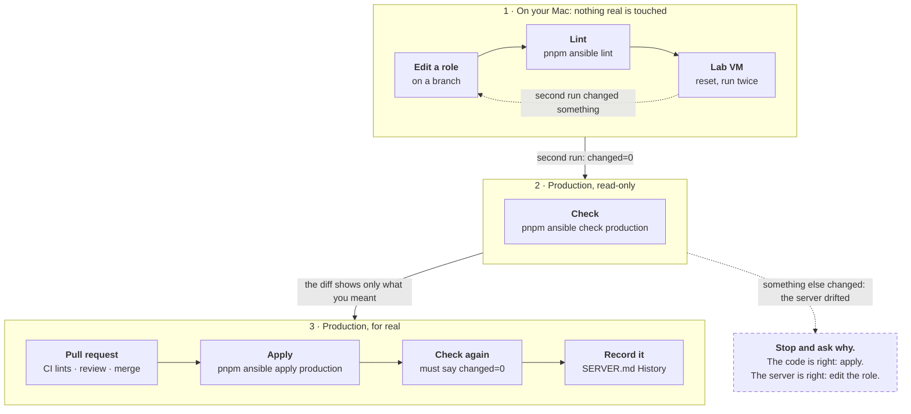

# Ansible

Status: ACTIVE · Owner: Evan · Last updated: 2026-10-06

Ansible keeps the **production server's own settings** as code in
`ops/ansible/`. [SERVER.md](SERVER.md) records 21 steps that were typed
by hand over SSH; the playbook is those steps, written so a computer can
repeat them. It can **check** the real server against the code without
changing anything, and it can turn a fresh Ubuntu machine into a copy of
the server.

Terraform ([TERRAFORM.md](TERRAFORM.md)) does the same for the Cloudflare
and AWS accounts. Ansible is for the machine itself. Why Ansible, and the
lines it never crosses: [ADR-063](../decisions/063-server-as-code-ansible.md).

---

## Where Ansible fits

Four tools own the infrastructure. Each has a clear edge:



Dashed: changed by hand, in Dokploy's dashboard. Everything else changes
only through a pull request.

## Words you need

| Word            | Meaning                                                                                                              |
| --------------- | -------------------------------------------------------------------------------------------------------------------- |
| **Playbook**    | The list of what the server should look like (`site.yml`).                                                           |
| **Role**        | One topic of the playbook, e.g. `ssh` or `swap`. One role per SERVER.md section; each role's tasks name its section. |
| **Task**        | One step in a role: "this file has this content", "this package is installed".                                       |
| **Inventory**   | Which machines to run on: `production` (the VPS, through your `ssh echoandaura` alias) or `lab` (a VM on your Mac).  |
| **Check mode**  | A preview. Ansible logs in, compares, and reports what it _would_ change. Changes nothing. Like `terraform plan`.    |
| **`changed=0`** | The best answer from check mode: the server already matches the code exactly.                                        |
| **Idempotent**  | Running it twice is safe: the second run changes nothing. Every role here must be.                                   |
| **Handler**     | A follow-up that runs only if a task changed something, e.g. "reload SSH" only when its config changed.              |

## Layout

```
ops/ansible/
  site.yml               the playbook: which roles, in which order
  roles/<name>/tasks/    the steps (each file says which SERVER.md § it is)
  roles/<name>/files/    files copied as they are (e.g. 00-hardening.conf)
  group_vars/all.yml     values shared by lab and production (hostname, swap size)
  inventory/             production.yml (committed); lab.yml (written by lab.sh)
  pyproject.toml, uv.lock   ansible-core 2.21.5 + ansible-lint 26.9.0, pinned
  requirements.yml       collections ansible.posix 2.2.2, community.general 13.5.0
  run.sh, lab.sh         the two scripts behind the pnpm commands below
```

The tools install into `ops/ansible/.venv` with `uv` (no global
install), and the collections into `ops/ansible/collections`. Both are
git-ignored and appear on the first run.

## What is code, and what stays by hand

Every section of [SERVER.md](SERVER.md), and who owns it today:

| §   | Topic                                     | Owner                                                                                       |
| --- | ----------------------------------------- | ------------------------------------------------------------------------------------------- |
| 1   | Ubuntu 24.04, the VPS itself              | By hand: the provider's panel                                                               |
| 2   | SSH: keys only                            | `ssh`                                                                                       |
| 3   | Swap                                      | `swap`                                                                                      |
| 4   | Automatic security updates                | `base`                                                                                      |
| 5   | Hostname and clock                        | `base`                                                                                      |
| 6   | Firewall (ufw)                            | `firewall`                                                                                  |
| 7   | Docker's log limits                       | `docker_config`                                                                             |
| 8   | Dokploy                                   | `dokploy` installs it; the owner account by hand                                            |
| 9   | The dashboard's address, port 3000 closed | `origin_lockdown` drops 3000; the address, in Dokploy, by hand                              |
| 10  | The app's Postgres and Redis              | In Dokploy, by hand; `sysctl` sets what Redis needs from the kernel                         |
| 11  | The app (Dokploy Compose)                 | In Dokploy, by hand; the compose file is in the repository                                  |
| 12  | First deploy                              | History. Deploys are GitHub Actions now ([../DEPLOY.md](../DEPLOY.md))                      |
| 13  | Cloudflare in front                       | Cloudflare: Terraform. Traefik's trusted IPs: by hand, checked by `traefik`                 |
| 14  | Admin accounts                            | By hand, with the `create-admin` script ([../DEPLOY.md](../DEPLOY.md))                      |
| 15  | Test data removed                         | History, done once                                                                          |
| 16  | Nightly backups                           | The schedules, in Dokploy, by hand. The buckets: off-site S3 by Terraform, R2 by hand       |
| 17  | Disk hygiene                              | `apt_clean`; Docker's image cleanup is a Dokploy setting                                    |
| 18  | Monitoring and alerts                     | `disk_alert`; the outside checks live in Better Stack                                       |
| 19  | The app's database role                   | By hand: it needs the database password                                                     |
| 20  | Only Cloudflare reaches the web ports     | `origin_lockdown`, with `firewall`                                                          |
| 21  | A cap on requests in flight               | `traefik` owns the middleware file; the line that applies it: by hand, checked by `traefik` |

What stays by hand stays by hand on purpose. Dokploy keeps its settings
in its own database, so a file-based tool can't own them. Traefik's
`traefik.yml` belongs to Dokploy, which rewrites it. The database role
needs a password that must never reach the repository.

## The roles

In the order the playbook runs them. Each role's tasks name their
SERVER.md section.

| Role              | §        | What it does                                                                         |
| ----------------- | -------- | ------------------------------------------------------------------------------------ |
| `base`            | 4, 5     | hostname and `/etc/hosts`, UTC, automatic security updates                           |
| `ssh`             | 2        | your public key for root; keys only, checked by `sshd -t` before saving              |
| `swap`            | 3        | a 2 GB `/swapfile` (created only if missing), swappiness 10                          |
| `firewall`        | 6, 9, 20 | ufw: SSH allowed **first**, then deny incoming; 80, 443, 3000 kept closed            |
| `docker_config`   | 7        | container logs capped at 3 × 10 MB. **Never restarts Docker**: it prints a reminder  |
| `origin_lockdown` | 9, 20    | only Cloudflare reaches 80 and 443; **nobody reaches 3000**. Armed before Docker     |
| `dokploy`         | 8        | installs Dokploy **once**, from its reviewed script; never upgrades; checks health   |
| `sysctl`          | 10       | `vm.overcommit_memory = 1`, so Redis can save its snapshots                          |
| `apt_clean`       | 17       | apt's cache cleaned every 7 days                                                     |
| `disk_alert`      | 18       | an hourly disk check that messages Telegram above 80 %                               |
| `traefik`         | 13, 21   | owns the in-flight cap file; **only checks** Dokploy's `traefik.yml`, never edits it |

Details worth knowing:

- **ufw does not protect the web ports.** Docker publishes ports around
  it. `origin_lockdown` does, in Docker's `DOCKER-USER` chain. Its
  Cloudflare list is the one source: a unit test keeps it equal to
  `src/lib/client-ip.ts`, and the `traefik` role checks Traefik against
  it. It reads the internet-facing interface from
  `/etc/default/origin-lockdown`, written from the server's facts (`eth0`
  in production).
- **Dokploy installs itself, once.** The role runs Dokploy's own install
  script, kept in `roles/dokploy/files/` exactly as reviewed and pinned
  by checksum (a unit test fails on any edit), pinned to
  `dokploy_version`. Dokploy then updates itself from its dashboard; when
  production moves past the pin, a run says so. Every run checks that
  `dokploy` and `dokploy-postgres` are running (1/1) and Traefik is up,
  and stops with the fix on an install that ended half way.
- **`traefik.yml` belongs to Dokploy**, which rewrites it when its web
  server settings change. If a check fails with "traefik.yml lost a hand
  edit", put back what the message names (SERVER.md § 13 / § 21), restart
  Traefik, and check again.
- **The disk alert needs two values in `.env`** (Bitwarden: Telegram
  alert bot): `ALERTS_TELEGRAM_BOT_TOKEN` and `ALERTS_TELEGRAM_CHAT_ID`.
  Without them, a production run stops at `disk_alert` rather than write
  empty values; `--skip-tags alerts_secret` skips just that file. The lab
  gets placeholders.

## Before you start (once per laptop)

1. `uv` (already on this Mac: `uv --version`).
2. Your SSH alias `echoandaura` works: `ssh echoandaura hostname`.
3. Your public key at `~/.ssh/echoandaura_vps.pub`, or set
   `ANSIBLE_SSH_PUBLIC_KEY=/path/to/key.pub` in `.env`.
4. For the lab: Multipass, `brew install --cask multipass`.

## The four speeds of testing

| How                          | Command                             | Time      | Touches    |
| ---------------------------- | ----------------------------------- | --------- | ---------- |
| Lint + syntax                | `pnpm ansible lint`                 | ~5 s      | nothing    |
| One role on the lab VM       | `pnpm ansible apply lab --tags ssh` | ~20–40 s  | the lab VM |
| Full run twice (idempotent?) | `pnpm ansible:lab test`             | a few min | the lab VM |
| Production preview           | `pnpm ansible check production`     | ~25 s     | reads only |

**The lab VM** is a copy of the server on your Mac (2 CPUs, 4 GB, 25 GB,
Ubuntu 24.04, root logs in with your key). `pnpm ansible:lab create` makes
it once and saves a snapshot called `fresh`; `pnpm ansible:lab reset`
goes back to it in seconds, so you never wait for a rebuild. Save your
own snapshots with `pnpm ansible:lab snapshot <name>`. **`with-dokploy`**
(saved 2026-10-06) is the lab after a full rebuild: Dokploy installed,
Traefik's hand edits in; `pnpm ansible:lab reset with-dokploy` skips the
~7-minute install. It runs ARM (Apple silicon) while production is x86:
the roles don't care, and production check mode is the final word.

## Making a change to the server

Three stages, and production is touched only in the last:



Step by step:

1. Edit the role on a branch.
2. `pnpm ansible lint`.
3. `pnpm ansible:lab reset`, then `pnpm ansible:lab test`: must end with
   `OK: the second run changed nothing.`
4. `pnpm ansible check production`: read the `--diff` output. It shows
   exactly what would change on the server, line by line.
5. Open the PR with that output's summary; CI runs `ansible` (lint).
6. After merge: `pnpm ansible apply production`. It asks you to type
   `echoandaura` first. Keep a second SSH window open when the change
   touches SSH or the firewall.
7. `pnpm ansible check production` again: **`changed=0`**.
8. A row in SERVER.md's History and this page's.

**Never change a managed setting by hand over SSH.** The next apply puts
it back. In an emergency, change it by hand, then copy the change into
the role the same day; check mode shows `changed=0` once they match.

## Rebuilding a server

From a blank Ubuntu to the site answering: the playbook (about 7
minutes), a few steps by hand, then the app and its data. The diagram and
the exact steps are in SERVER.md → [Rebuilding from scratch](SERVER.md#rebuilding-from-scratch).
Rehearsed on the lab VM on 2026-10-06.

## When something goes wrong

- **`UNREACHABLE`**: `ssh echoandaura` doesn't work either → fix SSH first
  (SERVER.md § Getting in). Lab: `pnpm ansible:lab reset` rewrites its
  address.
- **Check mode says `changed=1` or more on production, and nobody changed
  the role**: the server drifted. Read the diff, find out who changed it
  and why, then either apply (the code wins) or update the role (the
  server wins). Never apply blindly.
- **`CERTIFICATE_VERIFY_FAILED` from Galaxy** on a new Mac: `run.sh` uses
  `/etc/ssl/cert.pem`; if it still fails, install certificates for that
  Python (python.org: _Install Certificates.command_).

## History

| Date       | Change                                                                                                                                                                                                                                                                                                                                                                                                                                                                                                                                                                                                                                                                                                                                                                              |
| ---------- | ----------------------------------------------------------------------------------------------------------------------------------------------------------------------------------------------------------------------------------------------------------------------------------------------------------------------------------------------------------------------------------------------------------------------------------------------------------------------------------------------------------------------------------------------------------------------------------------------------------------------------------------------------------------------------------------------------------------------------------------------------------------------------------- |
| 2026-10-06 | Slice A: `ops/ansible/`, roles `base`, `ssh`, `swap`, lab VM scripts, CI `ansible` (lint). Production check mode: **ok=13 changed=0** on the first run. Lab VM (Multipass, from `fresh`): full run, then a second run changed nothing                                                                                                                                                                                                                                                                                                                                                                                                                                                                                                                                               |
| 2026-10-06 | Slice B: roles `firewall`, `docker_config`, `sysctl`, `apt_clean`. Production check mode: **ok=25 changed=0**. Lab from `fresh`: changed=21, then the second run changed=0 (SSH still reachable with ufw on); 45 s including the reset                                                                                                                                                                                                                                                                                                                                                                                                                                                                                                                                              |
| 2026-10-06 | Slice C: roles `origin_lockdown`, `disk_alert`, `traefik` (scripts moved from `ops/server/`; unit test path updated). Production check (alerts secret skipped until `.env` has it): **ok=37 changed=0**. Traefik guard tested on broken copies: a missing range and a missing middleware both fail. Lab: changed=29, then changed=0                                                                                                                                                                                                                                                                                                                                                                                                                                                 |
| 2026-10-06 | Slice D: role `dokploy` (installs once with the reviewed script kept in the repo, hash-pinned, `dokploy_version` v0.30.8; checks dokploy/postgres 1/1 + Traefik on every run; stops on a half install). `origin_lockdown` runs before it, drops 3000 for everyone, and reads its interface from `/etc/default/origin-lockdown`. **Rebuild rehearsal** on the lab from `fresh`: full run 7 min 23 s, stopped at the `traefik` guard as expected; 3000/80/443 closed from the Mac, open with the lockdown removed (control); tunnel to 3000 works; hand edits → `lab test` changed=0; snapshot `with-dokploy`. A cut-short install (Traefik missing) fails with its fix. Production check: **changed=4**, all the lockdown (script, `/etc/default`, unit, re-apply); `dokploy` all ok |
| 2026-10-06 | Slice D applied to production: changed=4 (the lockdown), then check changed=0. Slice E: ADR-063; this page restructured (where Ansible fits, what is code and what stays by hand, the change and rebuild diagrams). **9.2 done**                                                                                                                                                                                                                                                                                                                                                                                                                                                                                                                                                    |
