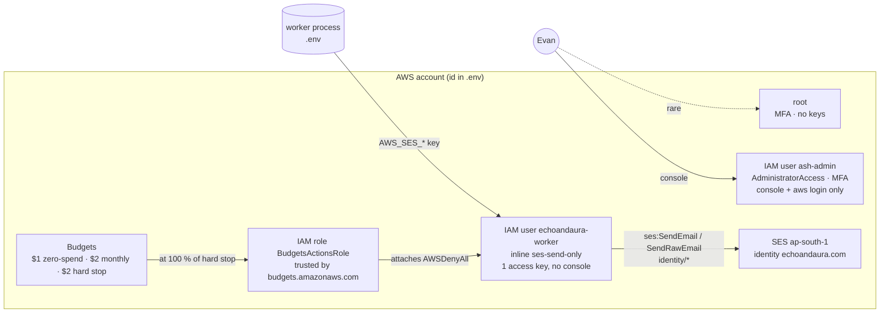

# AWS

Status: ACTIVE · Owner: Evan · Last updated: 2026-09-20

The only AWS service this project uses is **Amazon SES**, for outbound
transactional email. Everything else on the account exists to keep that
safe and cheap: two IAM principals, three budgets, one send-only key.
Nothing here is infrastructure-as-code — it was set up once by hand and
this page is the record. `pnpm infra:check` proves it is still true.

How email flows through SES, and what to do when a message does not
arrive, is in [../systems/EMAIL.md](../systems/EMAIL.md). DNS records that
SES depends on are owned by [CLOUDFLARE.md](CLOUDFLARE.md). Credentials
are inventoried in [SECRETS.md](SECRETS.md) — never here.

---

## Account

| Item                | Value                                                                                  |
| ------------------- | -------------------------------------------------------------------------------------- |
| Account id          | in `.env` as `AWS_ACCOUNT_ID` and in Bitwarden `AWS ash-admin` (this repo is public)   |
| Region              | **`ap-south-1`** (Mumbai) for everything. SES identities are per-region; do not stray. |
| Support plan        | Basic (free)                                                                           |
| Root sign-in        | Bitwarden item `AWS root` — MFA on, **no access keys**, used only for account settings |
| Alternate contacts  | Billing, Operations, Security → Evan (Account → Alternate contacts)                    |
| IAM billing access  | Activated (so `ash-admin` can see Billing)                                             |
| Console sign-in URL | `https://<account-id>.signin.aws.amazon.com/console`                                   |
| CLI profile         | `echoandaura` in `~/.aws/config`, signed in with `aws login` as `ash-admin`            |

Root is for: alternate contacts, closing the account, and nothing else.
Day-to-day console work is `ash-admin`; the app never holds anything but
the worker key.

## Principals



| Principal            | Type     | Permissions                                                                    | Credentials                          | Purpose                            |
| -------------------- | -------- | ------------------------------------------------------------------------------ | ------------------------------------ | ---------------------------------- |
| root                 | root     | everything                                                                     | password + MFA; **0 access keys**    | account-level settings only        |
| `ash-admin`          | IAM user | `AdministratorAccess`, `IAMUserChangePassword` (managed)                       | password + MFA; **0 access keys**    | console and `aws login` for humans |
| `echoandaura-worker` | IAM user | inline `ses-send-only` (below)                                                 | 1 access key → `AWS_SES_*` in `.env` | the worker process sends email     |
| `BudgetsActionsRole` | IAM role | `AWSBudgetsActionsWithAWSResourceControlAccess`; trust `budgets.amazonaws.com` | —                                    | lets the hard-stop budget act      |

### `ses-send-only` (inline policy on `echoandaura-worker`)

```json
{
  "Version": "2012-10-17",
  "Statement": [
    {
      "Effect": "Allow",
      "Action": ["ses:SendEmail", "ses:SendRawEmail"],
      "Resource": "arn:aws:ses:ap-south-1:<account-id>:identity/*"
    }
  ]
}
```

Why `identity/*` and not the domain: while the account is in the SES
sandbox, SES authorises against the **recipient** identity as well
(every recipient there is a verified identity), and a domain-only
resource fails with `AccessDeniedException … identity/<recipient>`. The
two actions are the safety boundary — a leaked key can send email from
our identities and do nothing else. Do not add a `configuration-set/*`
resource; we deliberately run without configuration sets (see SES below).

## Budgets and cost

AWS has **no hard spending cap**. Budgets only alert. What makes a surprise
bill impossible here is that the only long-lived credential on any server
is the send-only worker key, so nothing can create billable resources.

| Budget (Billing → Budgets)          | Limit / month | Alerts                              | Action                                                                  |
| ----------------------------------- | ------------- | ----------------------------------- | ----------------------------------------------------------------------- |
| `Echo And Aura Zero-Spend Budget`   | $1            | any spend at all → email            | —                                                                       |
| `Echo and Aura Monthly Cost Budget` | $2            | 85 % actual, 100 % forecast → email | —                                                                       |
| `Echo and Aura hard stop budget`    | $2            | 100 % actual → email                | attaches `AWSDenyAll` to `echoandaura-worker` (automatic, via the role) |

Plus **Cost Anomaly Detection**, monitor `Default-Services-Monitor`, and
Free Tier / CloudWatch billing alerts in Billing preferences. Alerts go to
the billing alternate contact.

Expected bill: SES is free for the first 3,000 messages/month in the
first year, then **$0.10 per 1,000**; at ~1,500/month that rounds to
cents. If a monthly bill is ever more than a few cents, something outside
this document is running — see _Runbooks → A budget alert fired_.

> **Open item:** SES _Virtual Deliverability Manager_ is currently
> **enabled** (the console's getting-started wizard turns it on). It bills
> per message. Disable it under SES → Virtual Deliverability Manager →
> Settings unless someone is actually using its dashboards.

## SES

| Item               | Value                                                                                                                                                                 |
| ------------------ | --------------------------------------------------------------------------------------------------------------------------------------------------------------------- |
| Region             | `ap-south-1`                                                                                                                                                          |
| Domain identity    | `echoandaura.com` — **Verified**, Easy DKIM (RSA 2048, 3 CNAME tokens), MAIL FROM `mail.echoandaura.com`                                                              |
| Email identity     | the organizer's Gmail — verified so it can _receive_ while the account is in the sandbox                                                                              |
| Configuration sets | **none.** The identities have no default set. (The wizard's `my-first-configuration-set` was deleted; a dangling default breaks every send with `NotFoundException`.) |
| Suppression list   | account-level, BOUNCE + COMPLAINT (default)                                                                                                                           |
| Mail type          | Transactional                                                                                                                                                         |
| Production access  | **Requested 2026-09-20** (case id in Bitwarden `AWS ash-admin`). Until granted: sandbox — 200 msgs/day, 1/s, verified recipients only                                 |
| Sending in the app | `MAILER=ses`, `EMAIL_FROM="echoandaura <tickets@echoandaura.com>"`, `EMAIL_REPLY_TO=hello@echoandaura.com` — see [../ENVIRONMENT.md](../ENVIRONMENT.md)               |

What each DNS record does for SES, and the authoritative record list, is
in [CLOUDFLARE.md](CLOUDFLARE.md). The worker sends raw MIME through the
SESv2 `SendEmail` API at ≤ 5/s; SES's default production rate is 14/s.

### What the sandbox means for the app

Nothing is lost. A send to an unverified address fails with
`MessageRejected`, which the worker treats as permanent; the order keeps
its `email.failed` audit row and the admin can re-send from the order
page after production access lands. Test with the verified Gmail only.

## Runbooks

### Rotate the worker key

Two keys may be active at once, so this is zero-downtime.

1. IAM → Users → `echoandaura-worker` → Security credentials → **Create
   access key** → "Application running outside AWS" → copy both values into
   Bitwarden item `AWS worker key (SES)` (replace the old values there).
2. Put the new pair into `.env` on every host that runs the worker
   (`AWS_SES_ACCESS_KEY_ID`, `AWS_SES_SECRET_ACCESS_KEY`) and restart the
   worker.
3. `pnpm email:test <verified address>` on that host → "SES accepted".
4. Back in IAM: **Deactivate** the old key, wait a day, **Delete** it.
5. `pnpm infra:check` → the key row shows exactly one active key.

If a key may have leaked: do step 4 first, then the rest. A leaked
send-only key can only send email from our domain; check SES → Account
dashboard → Sending statistics for unexpected volume, and open a support
case if there is any.

### Change the alternate contacts / billing email

Root sign-in → account menu → **Account** → _Alternate contacts_ → Edit.
Budgets email whoever is on the budget itself: Billing → Budgets → the
budget → Edit → notification recipients. Update all three budgets.

### A budget alert fired

1. Billing → **Bills** → current month → expand the service. If it is
   anything other than _Simple Email Service_, a resource exists that this
   document does not know about: Console → Resource Explorer (or the
   service's console in `ap-south-1` and `us-east-1`) and delete it.
2. If it _is_ SES: SES → Account dashboard → Sending statistics. Volume
   far above the app's audit trail (`order_events` rows with
   `email.sent`) means the worker key is being used elsewhere → rotate it
   (above).
3. If the hard-stop action ran, the worker now carries `AWSDenyAll` and
   every send fails with `AccessDenied`. Once the cause is fixed: IAM →
   `echoandaura-worker` → Permissions → detach `AWSDenyAll`; Budgets →
   the hard-stop budget → Actions → reset the action to _Standby_.

### Add a second admin (human)

IAM → Users → Create user → console access, own password → attach
`AdministratorAccess` → **MFA before first real use** → they sign in at
the console URL above. Never share `ash-admin`.

### Production access denied or stalled

Reply on the support case (Support Center → Your support cases) with the
volume, trigger, bounce handling and example subjects — the text used on
2026-09-20 is in `notes/aws.md` history and in ENVIRONMENT.md § Email.
AWS answers within 24 h; a second follow-up usually resolves it. The app
does not need changes when access is granted.

### Move to another region or account

1. Create the domain identity in the new region/account, add its three
   DKIM CNAMEs and the MAIL FROM records in Cloudflare (old ones can stay
   during the switch), wait for **Verified**.
2. Request production access there (it is per region per account).
3. Create the worker user + policy, new key → `.env` (`AWS_SES_REGION`
   too) → restart worker → `pnpm email:test`.
4. Remove the old identity, key and, if a new account, close the old one
   from root (Account → Close account) after the final bill.

## Verify

`pnpm infra:check` runs all of this. By hand, with `AWS_PROFILE=echoandaura`:

```bash
aws sts get-caller-identity --query Arn                       # …:user/ash-admin, never :root
aws iam list-access-keys --user-name ash-admin                # []
aws iam list-access-keys --user-name echoandaura-worker       # exactly one Active
aws iam get-user-policy --user-name echoandaura-worker --policy-name ses-send-only
aws sesv2 get-email-identity --email-identity echoandaura.com \
  --query '{Verified:VerifiedForSendingStatus,Dkim:DkimAttributes.Status,MailFrom:MailFromAttributes.MailFromDomainStatus,ConfigSet:ConfigurationSetName}'
                                                              # true, SUCCESS, SUCCESS, null
aws sesv2 get-account --query '{Production:ProductionAccessEnabled,Max24h:SendQuota.Max24HourSend}'
aws budgets describe-budgets --account-id "$AWS_ACCOUNT_ID" --query 'Budgets[].BudgetName'
pnpm email:test <verified address>                            # "SES accepted the message: …"
```

## History

| Date       | Change                                                                                                                           |
| ---------- | -------------------------------------------------------------------------------------------------------------------------------- |
| 2026-09-20 | Account created; root MFA; `ash-admin`; budgets; SES domain verified (DKIM, MAIL FROM); worker user; production access requested |
| 2026-09-20 | Worker policy widened to `identity/*` (sandbox recipient check); wizard configuration set deleted and cleared from identities    |
