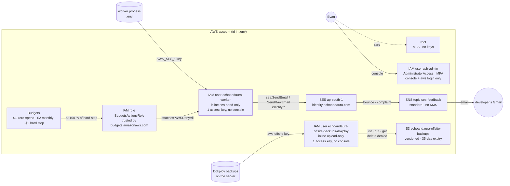
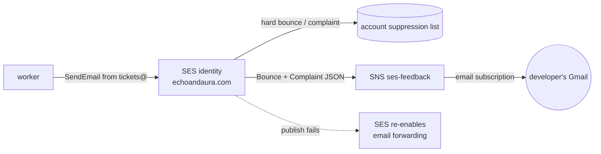

# AWS

Status: ACTIVE · Owner: Evan · Last updated: 2026-10-03

This project uses two AWS services: **Amazon SES**, now only the
**rollback** for outbound email (Cloudflare Email Service sends since
ADR-057; SES is retired after a few clean weeks), and one **S3 bucket** for the off-site copy of the
database backups ([S3 off-site backups](#s3-off-site-backups), ADR-051).
Everything else on the account exists to keep those safe and cheap: IAM
principals, three budgets, one send-only key, one upload-only key, and
one SNS topic that tells the developer about bounces and complaints.
The SES side was set up once by hand and this page is the record
(`pnpm infra:check` proves it is still true); the S3 side is
CloudFormation, `ops/aws/offsite-backups.yaml`.

How email flows through SES, and what to do when a message does not
arrive, is in [../systems/EMAIL.md](../systems/EMAIL.md). DNS records that
SES depends on are owned by [CLOUDFLARE.md](CLOUDFLARE.md). Credentials
are inventoried in [SECRETS.md](SECRETS.md) — never here.

---

## Account

| Item                | Value                                                                                  |
| ------------------- | -------------------------------------------------------------------------------------- |
| Account id          | in `.env` as `AWS_ACCOUNT_ID` and in Bitwarden `AWS ash-admin` (this repo is public)   |
| Region              | **`ap-south-1`** (Mumbai) for everything. SES identities are per-region; do not stray. |
| Support plan        | Basic (free)                                                                           |
| Root sign-in        | Bitwarden item `AWS root` — MFA on, **no access keys**, used only for account settings |
| Alternate contacts  | Billing, Operations, Security → Evan (Account → Alternate contacts)                    |
| IAM billing access  | Activated (so `ash-admin` can see Billing)                                             |
| Console sign-in URL | `https://<account-id>.signin.aws.amazon.com/console`                                   |
| CLI profile         | `echoandaura` in `~/.aws/config`, signed in with `aws login` as `ash-admin`            |

Root is for: alternate contacts, closing the account, and nothing else.
Day-to-day console work is `ash-admin`; the app never holds anything but
the worker key.

## Principals


```mermaid
flowchart LR
  subgraph account["AWS account (id in .env)"]
    root["root\nMFA · no keys"]
    admin["IAM user ash-admin\nAdministratorAccess · MFA\nconsole + aws login only"]
    worker["IAM user echoandaura-worker\ninline ses-send-only\n1 access key, no console"]
    role["IAM role BudgetsActionsRole\ntrusted by budgets.amazonaws.com"]
    ses["SES ap-south-1\nidentity echoandaura.com"]
    budgets["Budgets\n$1 zero-spend · $2 monthly · $2 hard stop"]
    sns["SNS topic ses-feedback\nstandard · no KMS"]
    offsite["IAM user echoandaura-offsite-backups-dokploy\ninline upload-only\n1 access key, no console"]
    bucket["S3 echoandaura-offsite-backups\nversioned · 35-day expiry"]
  end
  evan((Evan)) -->|console| admin
  evan -.->|rare| root
  app[(worker process\n.env)] -->|AWS_SES_* key| worker
  worker -->|ses:SendEmail / SendRawEmail\nidentity/*| ses
  budgets -->|at 100 % of hard stop| role
  role -->|attaches AWSDenyAll| worker
  ses -->|bounce · complaint| sns
  dokploy[(Dokploy backups\non the server)] -->|aws-offsite key| offsite
  offsite -->|list · put · get\ndelete denied| bucket
  sns -->|email| dev((developer's Gmail))
```

| Principal                             | Type     | Permissions                                                                    | Credentials                          | Purpose                             |
| ------------------------------------- | -------- | ------------------------------------------------------------------------------ | ------------------------------------ | ----------------------------------- |
| root                                  | root     | everything                                                                     | password + MFA; **0 access keys**    | account-level settings only         |
| `ash-admin`                           | IAM user | `AdministratorAccess`, `IAMUserChangePassword` (managed)                       | password + MFA; **0 access keys**    | console and `aws login` for humans  |
| `echoandaura-worker`                  | IAM user | inline `ses-send-only` (below)                                                 | 1 access key → `AWS_SES_*` in `.env` | the worker process sends email      |
| `echoandaura-offsite-backups-dokploy` | IAM user | inline `upload-only` (CloudFormation)                                          | 1 access key → Dokploy `aws-offsite` | Dokploy uploads the off-site backup |
| `BudgetsActionsRole`                  | IAM role | `AWSBudgetsActionsWithAWSResourceControlAccess`; trust `budgets.amazonaws.com` | —                                    | lets the hard-stop budget act       |

### `ses-send-only` (inline policy on `echoandaura-worker`)

```json
{
  "Version": "2012-10-17",
  "Statement": [
    {
      "Effect": "Allow",
      "Action": ["ses:SendEmail", "ses:SendRawEmail"],
      "Resource": "arn:aws:ses:ap-south-1:<account-id>:identity/*"
    }
  ]
}
```

Why `identity/*` and not the domain: while the account is in the SES
sandbox, SES authorises against the **recipient** identity as well
(every recipient there is a verified identity), and a domain-only
resource fails with `AccessDeniedException … identity/<recipient>`. The
two actions are the safety boundary — a leaked key can send email from
our identities and do nothing else. Do not add a `configuration-set/*`
resource; we deliberately run without configuration sets (see SES below).

## S3 off-site backups

Stack `echoandaura-offsite-backups` (`ap-south-1`), from
`ops/aws/offsite-backups.yaml`. Change it by editing the template and
running the deploy command at its top; never in the console.

| Item       | Value                                                                                                                                                    |
| ---------- | -------------------------------------------------------------------------------------------------------------------------------------------------------- |
| Bucket     | `echoandaura-offsite-backups`: private (all four public-access blocks), SSE-S3, versioning on, HTTPS only, kept if the stack is deleted                  |
| Lifecycle  | files and old versions expire after **35 days**; unfinished uploads after 1 day                                                                          |
| Writer     | IAM user `echoandaura-offsite-backups-dokploy`: `ListBucket`, `PutObject`, `GetObject`, multipart; **delete and bucket config denied**                   |
| Key        | made by hand (IAM → the user → Security credentials), never through CloudFormation. Bitwarden `AWS offsite backups key (Dokploy)`; Dokploy `aws-offsite` |
| Written by | Dokploy, daily 03:30 Dhaka ([SERVER.md § 16](SERVER.md))                                                                                                 |
| Cost       | $0.025 / GB-month; about 15 kB per dump today, so well under a cent                                                                                      |

Why read is allowed: rclone (inside Dokploy) checks every upload with a
HEAD request, and without `GetObject` the file lands but the backup
reports failure. **Rotate the key:** create a second key on the user →
Dokploy → Settings → S3 Destinations → `aws-offsite` → new key → **Test**
→ run the backup by hand → deactivate, then delete the old key →
Bitwarden.

## Budgets and cost

AWS has **no hard spending cap**. Budgets only alert. What keeps a surprise
bill unlikely here is that the long-lived credentials on the server are
narrow: the send-only worker key, and the backup key, which can only add
files to one bucket (anything it adds expires in 35 days). Neither can
create billable resources.

| Budget (Billing → Budgets)          | Limit / month | Alerts                              | Action                                                                  |
| ----------------------------------- | ------------- | ----------------------------------- | ----------------------------------------------------------------------- |
| `Echo And Aura Zero-Spend Budget`   | $1            | any spend at all → email            | —                                                                       |
| `Echo and Aura Monthly Cost Budget` | $2            | 85 % actual, 100 % forecast → email | —                                                                       |
| `Echo and Aura hard stop budget`    | $2            | 100 % actual → email                | attaches `AWSDenyAll` to `echoandaura-worker` (automatic, via the role) |

Plus **Cost Anomaly Detection**, monitor `Default-Services-Monitor`, and
Free Tier / CloudWatch billing alerts in Billing preferences. Alerts go to
the billing alternate contact.

SNS (bounce and complaint notifications only) is free at this volume: the
first 1,000 email notifications and the first 1,000,000 requests each month
cost nothing, then $2 per 100,000 emails (AWS Price List, `ap-south-1`).

Expected bill: SES is free for the first 3,000 messages/month in the
first year, then **$0.10 per 1,000**; at ~1,500/month that rounds to
cents. If a monthly bill is ever more than a few cents, something outside
this document is running — see _Runbooks → A budget alert fired_.

Two SES features are billed per message and are **off** (the console's
getting-started wizard had turned both on; switched off 2026-09-28):

- **Virtual Deliverability Manager** — dashboards nobody reads.
- **Auto Validation** — SES scores every recipient and silently drops mail
  to addresses it rates risky, while still charging the send and a
  validation fee. For us that means a buyer who typed a real address
  could never get their tickets, with nothing in our logs. The
  suppression list already stops repeat sends to addresses that bounced.

`pnpm infra:check` fails if either comes back on.

To switch Auto Validation off from the CLI, repeat the suppression reasons
or the list stops collecting bounces and complaints. The flag is
`--validation-attributes`; the SES guide's `--validation-options` is
rejected by the CLI:

```bash
aws sesv2 put-account-suppression-attributes --region ap-south-1 \
  --suppressed-reasons BOUNCE COMPLAINT \
  --validation-attributes 'ConditionThreshold={ConditionThresholdEnabled=DISABLED}'
```

## SES

| Item               | Value                                                                                                                                                                                                                                                  |
| ------------------ | ------------------------------------------------------------------------------------------------------------------------------------------------------------------------------------------------------------------------------------------------------ |
| Region             | `ap-south-1`                                                                                                                                                                                                                                           |
| Domain identity    | `echoandaura.com` — **Verified**, Easy DKIM (RSA 2048, 3 CNAME tokens), MAIL FROM `mail.echoandaura.com`                                                                                                                                               |
| Email identities   | the organizer's Gmail, and the developer's Gmail (added 2026-09-28, for the admin email-change tests) — verified so they can _receive_ while the account is in the sandbox. Any `@echoandaura.com` address can receive too: the domain identity counts |
| Configuration sets | **none.** The identities have no default set. (The wizard's `my-first-configuration-set` was deleted; a dangling default breaks every send with `NotFoundException`.)                                                                                  |
| Suppression list   | account-level, BOUNCE + COMPLAINT (default). Auto Validation **off** (see Budgets and cost)                                                                                                                                                            |
| Feedback           | Identity `echoandaura.com` → Bounce and Complaint → SNS topic `ses-feedback` (original headers included); Delivery → none; email feedback forwarding **off**. Topic has one email subscription, the developer's Gmail. See below                       |
| Mail type          | Transactional                                                                                                                                                                                                                                          |
| Production access  | **Denied 2026-09-21**, **reopened 2026-09-28** on the same case (case id in Bitwarden `AWS ash-admin`). Sandbox until re-granted — 200 msgs/day, 1/s, verified recipients only. Reopen after the domain is live: see the runbook below                 |
| Sending in the app | `MAILER=ses`, `EMAIL_FROM="echoandaura <tickets@echoandaura.com>"`, `EMAIL_REPLY_TO=hello@echoandaura.com` — see [../ENVIRONMENT.md](../ENVIRONMENT.md)                                                                                                |

What each DNS record does for SES, and the authoritative record list, is
in [CLOUDFLARE.md](CLOUDFLARE.md). The worker sends raw MIME through the
SESv2 `SendEmail` API at ≤ 5/s; SES's default production rate is 14/s.

### Bounce and complaint notifications


```mermaid
flowchart LR
  worker[worker] -->|SendEmail from tickets@| ses[SES identity\nechoandaura.com]
  ses -->|hard bounce / complaint| sup[(account suppression list)]
  ses -->|Bounce + Complaint JSON| topic[SNS ses-feedback]
  topic -->|email subscription| gmail((developer's Gmail))
  ses -. publish fails .-> fwd[SES re-enables\nemail forwarding]
```

Set on the **identity**, not through a configuration set, because we run
without configuration sets (ADR-039). The domain's settings cover every
`@echoandaura.com` sender; a verified _email_ identity would have its own
settings, and we send from none.

| Piece               | Setting                                                                                                                                                                                  |
| ------------------- | ---------------------------------------------------------------------------------------------------------------------------------------------------------------------------------------- |
| Topic               | `ses-feedback`, Standard (SES cannot publish to FIFO), `ap-south-1` (must match SES), no encryption                                                                                      |
| Access policy       | one statement: `ses.amazonaws.com` may `sns:Publish` to this topic when `AWS:SourceAccount` = our account and `AWS:SourceArn` = `arn:aws:ses:ap-south-1:<acct>:identity/echoandaura.com` |
| Subscription        | email → the developer's Gmail (confirmed). The organizer is not subscribed: the messages are raw JSON and a bounce is a developer's problem                                              |
| Identity            | Bounce + Complaint → topic, _Include original email headers_ on both; Delivery → no topic (one email per ticket would bury the rest)                                                     |
| Feedback forwarding | off — SNS carries both kinds. SES turns it back on by itself if a publish fails (topic deleted, policy broken) and emails the account about it                                           |

**Why no encryption:** SES can publish to an encrypted topic only if the
KMS key policy lets it, and the AWS-managed `alias/aws/sns` key's policy
cannot be edited. A customer-managed key costs about $1 a month, which
would trip the zero-spend and hard-stop budgets. The notification is then
emailed in plain text anyway, so encryption at rest would protect little.

**When one arrives:** `notificationType` is `Bounce` or `Complaint`;
`mail.commonHeaders.subject` and `.to` say which email and which buyer.

- _Bounce, `Permanent`_ — the address does not exist. SES has already put
  it on the suppression list, so later sends to it fail with
  `MessageRejected` (the worker does not retry). Contact the buyer another
  way (phone on the order) and change the address on the order before
  re-sending. Remove the address from the suppression list (SES →
  Suppressed destinations) only if the buyer confirms it now works.
- _Bounce, `Transient`_ — mailbox full, greylisting; SES already retried.
  Nothing to do unless it repeats.
- _Complaint_ — the buyer pressed "Report spam". It is on the suppression
  list. Rare for transactional mail; several in a week means a template
  or a sender name looks like spam.

**Test it** (safe in the sandbox, does not touch the reputation or the
suppression list):

```bash
pnpm email:test bounce@simulator.amazonses.com     # → a Bounce JSON email
pnpm email:test complaint@simulator.amazonses.com  # → a Complaint JSON email
```

### What the sandbox means for the app

Nothing is lost. A send to an unverified address fails with
`MessageRejected`, which the worker treats as permanent; the order keeps
its `email.failed` audit row and the admin can re-send from the order
page after production access lands. Test with the verified Gmail only.

## Runbooks

### Rotate the worker key

Two keys may be active at once, so this is zero-downtime.

1. IAM → Users → `echoandaura-worker` → Security credentials → **Create
   access key** → "Application running outside AWS" → copy both values into
   Bitwarden item `AWS worker key (SES)` (replace the old values there).
2. Put the new pair into `.env` on every host that runs the worker
   (`AWS_SES_ACCESS_KEY_ID`, `AWS_SES_SECRET_ACCESS_KEY`) and restart the
   worker.
3. `pnpm email:test <verified address>` on that host → "SES accepted".
4. Back in IAM: **Deactivate** the old key, wait a day, **Delete** it.
5. `pnpm infra:check` → the key row shows exactly one active key.

If a key may have leaked: do step 4 first, then the rest. A leaked
send-only key can only send email from our domain; check SES → Account
dashboard → Sending statistics for unexpected volume, and open a support
case if there is any.

### Change the alternate contacts / billing email

Root sign-in → account menu → **Account** → _Alternate contacts_ → Edit.
Budgets email whoever is on the budget itself: Billing → Budgets → the
budget → Edit → notification recipients. Update all three budgets.

### A budget alert fired

1. Billing → **Bills** → current month → expand the service. If it is
   anything other than _Simple Email Service_, a resource exists that this
   document does not know about: Console → Resource Explorer (or the
   service's console in `ap-south-1` and `us-east-1`) and delete it.
2. If it _is_ SES: SES → Account dashboard → Sending statistics. Volume
   far above the app's audit trail (`order_events` rows with
   `email.sent`) means the worker key is being used elsewhere → rotate it
   (above).
3. If the hard-stop action ran, the worker now carries `AWSDenyAll` and
   every send fails with `AccessDenied`. Once the cause is fixed: IAM →
   `echoandaura-worker` → Permissions → detach `AWSDenyAll`; Budgets →
   the hard-stop budget → Actions → reset the action to _Standby_.

### Add a second admin (human)

IAM → Users → Create user → console access, own password → attach
`AdministratorAccess` → **MFA before first real use** → they sign in at
the console URL above. Never share `ash-admin`.

### Production access denied or stalled

**Status 2026-09-28: reopened** on the original support case, with conditions 1–3 below met (the
account was 8 days old; condition 4's "couple of weeks" is our own guess,
not an AWS rule, and was waived). **2026-09-21: denied** with AWS's generic "unable to approve a
sending limit increase at this time" (no criteria given). Probable causes,
from experience rather than anything AWS states: the account was one day
old, `https://echoandaura.com` had nothing behind it when the reviewer
looked, and the reply said bounce/complaint notifications "will be added".
The use-case text itself (transactional only, ~1,000–2,000/month, no lists,
account-level suppression, verified domain with DKIM/SPF/DMARC) was fine
and can be reused.

Do **not** reopen with the same facts — repeated identical requests hurt
the account's standing. Reopen once all of these are true:

1. **Something is live at `echoandaura.com`** — at minimum a landing page
   (organizer, what the site is, `hello@` contact); ideally the staging
   deployment with a published event. The reviewer visits the URL.
2. **Bounce and complaint notifications exist** — done 2026-09-28: see
   _Bounce and complaint notifications_ above. Say "configured", not
   "will add". Keep the account-level suppression list on.
3. **Virtual Deliverability Manager is off** — done 2026-09-28, along with
   Auto Validation (see Budgets and cost).
4. The account is at least a couple of weeks old and `pnpm email:test` to
   the verified Gmail has sent a few real messages (a little history).

Then **Reopen case** on the original case (Support Center → Your support
cases → _SES: Production Access_), not a new one, with:

- the live URL and a screenshot of the registration page;
- one real example each of C1 (payment instructions) and C2 (tickets)
  rendered from `pnpm email:render`;
- volume: ~1,000–2,000/month, peaks of a few hundred/day in the three
  weeks before an event; worker rate limit 5/s;
- trigger: every message follows an action by its own recipient minutes
  earlier (registration, organizer approval); no lists, no marketing;
- bounces/complaints: SNS notifications to a monitored inbox + the
  account-level suppression list; permanent rejections are not retried;
- authentication: domain verified in `ap-south-1`, Easy DKIM, SPF, DMARC
  policy published, `hello@` monitored for replies;
- the first event date and that the earlier request was submitted before
  the site was live.

AWS answers within 24 h. If denied a second time, switch provider behind
the `Mailer` port ([../systems/EMAIL.md](../systems/EMAIL.md), ADR-016):
one adapter file plus env — Postmark or Resend both cover the volume for
~$15–20/month — and keep SES for later. Launch must not wait on this case.

### Move to another region or account

1. Create the domain identity in the new region/account, add its three
   DKIM CNAMEs and the MAIL FROM records in Cloudflare (old ones can stay
   during the switch), wait for **Verified**.
2. Request production access there (it is per region per account).
3. Create the worker user + policy, new key → `.env` (`AWS_SES_REGION`
   too) → restart worker → `pnpm email:test`.
4. Remove the old identity, key and, if a new account, close the old one
   from root (Account → Close account) after the final bill.

## Verify

`pnpm infra:check` runs all of this. By hand, with `AWS_PROFILE=echoandaura`:

```bash
aws sts get-caller-identity --query Arn                       # …:user/ash-admin, never :root
aws iam list-access-keys --user-name ash-admin                # []
aws iam list-access-keys --user-name echoandaura-worker       # exactly one Active
aws iam get-user-policy --user-name echoandaura-worker --policy-name ses-send-only
aws sesv2 get-email-identity --email-identity echoandaura.com \
  --query '{Verified:VerifiedForSendingStatus,Dkim:DkimAttributes.Status,MailFrom:MailFromAttributes.MailFromDomainStatus,ConfigSet:ConfigurationSetName}'
                                                              # true, SUCCESS, SUCCESS, null
aws sesv2 get-account --query '{Production:ProductionAccessEnabled,Max24h:SendQuota.Max24HourSend,Vdm:VdmAttributes.VdmEnabled,AutoValidation:SuppressionAttributes.ValidationAttributes.ConditionThreshold.ConditionThresholdEnabled}'
                                                              # …, DISABLED, DISABLED
aws ses get-identity-notification-attributes --identities echoandaura.com
                                                              # Bounce/ComplaintTopic …:ses-feedback, ForwardingEnabled false
aws sns get-topic-attributes --topic-arn "arn:aws:sns:ap-south-1:${AWS_ACCOUNT_ID}:ses-feedback" \
  --query 'Attributes.SubscriptionsConfirmed'                 # "1"
aws budgets describe-budgets --account-id "$AWS_ACCOUNT_ID" --query 'Budgets[].BudgetName'
aws s3api get-bucket-versioning --bucket echoandaura-offsite-backups      # Enabled
aws iam list-access-keys --user-name echoandaura-offsite-backups-dokploy  # exactly one Active
pnpm email:test <verified address>                            # "SES accepted the message: …"
```

## History

| Date       | Change                                                                                                                                                                                                                                                                                                    |
| ---------- | --------------------------------------------------------------------------------------------------------------------------------------------------------------------------------------------------------------------------------------------------------------------------------------------------------- |
| 2026-09-20 | Account created; root MFA; `ash-admin`; budgets; SES domain verified (DKIM, MAIL FROM); worker user; production access requested                                                                                                                                                                          |
| 2026-09-20 | Worker policy widened to `identity/*` (sandbox recipient check); wizard configuration set deleted and cleared from identities                                                                                                                                                                             |
| 2026-09-21 | Production access **denied** (generic refusal, account one day old, no site at the domain). Reopen after the domain is live — runbook above                                                                                                                                                               |
| 2026-09-28 | VDM and Auto Validation off; SNS topic `ses-feedback` for bounces + complaints on the domain identity, forwarding off, simulator-tested (ADR-039); production access case reopened with the live site                                                                                                     |
| 2026-10-03 | Off-site backups (ADR-051): stack `echoandaura-offsite-backups` from `ops/aws/offsite-backups.yaml` (bucket, upload-only user); key made by hand → Dokploy `aws-offsite`; updated the same day to allow `GetObject` (rclone's upload check). S4 check: root and `ash-admin` MFA on, 0 access keys on both |
