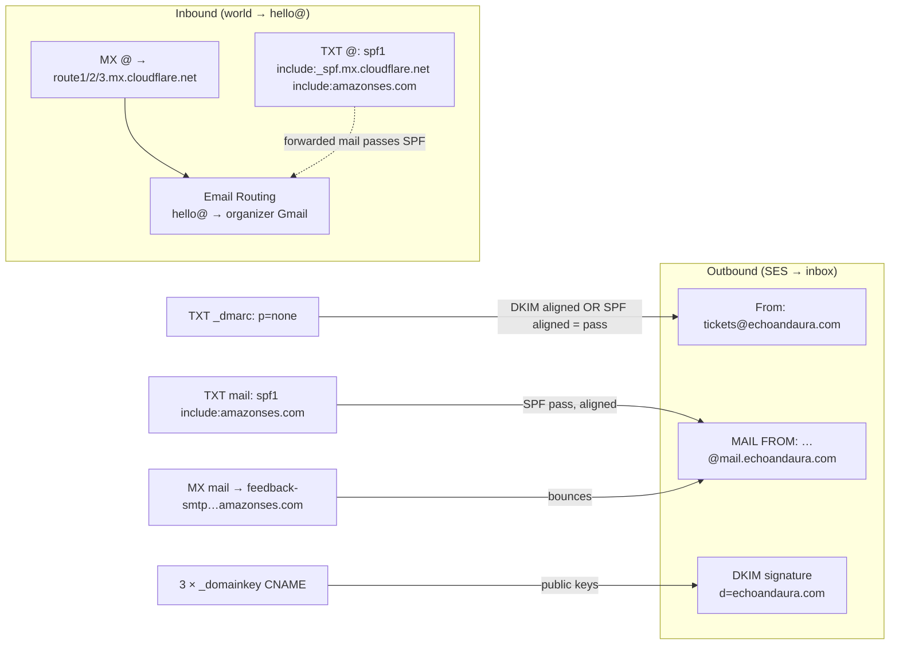

# Cloudflare

Status: ACTIVE · Owner: Evan · Last updated: 2026-09-20

Cloudflare holds the **domain** (registrar + authoritative DNS), receives
mail for `hello@` (**Email Routing**), and will hold event cover images
(**R2**, from Phase 6). It does not run the app. Every DNS record that
exists is in the table below — if a record is not here, it should not be
in the zone. `pnpm infra:check` resolves each one.

Sign-in: Bitwarden item `Cloudflare`. 2FA is on. There is one account
and one zone; no API tokens exist yet (R2 will add one).

---

## Domain

| Item        | Value                                                         |
| ----------- | ------------------------------------------------------------- |
| Zone        | `echoandaura.com`                                             |
| Registrar   | Cloudflare Registrar (auto-renew on; WHOIS redaction default) |
| Nameservers | `elisa.ns.cloudflare.com`, `vicky.ns.cloudflare.com`          |
| Plan        | Free                                                          |

## DNS — the authoritative record list

All mail records are **DNS only** (grey cloud). Proxying a DKIM CNAME or
an MX host breaks it silently. The app's own `A`/`AAAA` records arrive
with deployment (Phase 6) and are the only ones that should be proxied.

| Type   | Name (relative)                               | Content                                                            | Proxy    | Owner / purpose                                                                                              |
| ------ | --------------------------------------------- | ------------------------------------------------------------------ | -------- | ------------------------------------------------------------------------------------------------------------ |
| CNAME  | `tiqho3f6k6gqjjucwewakfvqyjmiu46q._domainkey` | `tiqho3f6k6gqjjucwewakfvqyjmiu46q.dkim.amazonses.com`              | DNS only | SES Easy DKIM (1 of 3) — signs outgoing mail                                                                 |
| CNAME  | `bjtddvusgm23hci2bzarxllb7py7l7kk._domainkey` | `bjtddvusgm23hci2bzarxllb7py7l7kk.dkim.amazonses.com`              | DNS only | SES Easy DKIM (2 of 3)                                                                                       |
| CNAME  | `tsrr3pkudaqmrgu7hdfft4camf656gro._domainkey` | `tsrr3pkudaqmrgu7hdfft4camf656gro.dkim.amazonses.com`              | DNS only | SES Easy DKIM (3 of 3)                                                                                       |
| TXT    | `@`                                           | `v=spf1 include:_spf.mx.cloudflare.net include:amazonses.com ~all` | —        | SPF for the root domain: Cloudflare Routing **and** SES. **One SPF record only** — merge, never add a second |
| TXT    | `_dmarc`                                      | `v=DMARC1; p=none; rua=mailto:hello@echoandaura.com`               | —        | DMARC policy; reports to `hello@`. Tighten to `p=quarantine` after a clean week (see runbook)                |
| MX     | `@`                                           | `route1.mx.cloudflare.net` (51), `route2…` (65), `route3…` (78)    | —        | Cloudflare Email Routing — inbound mail                                                                      |
| MX     | `mail`                                        | `feedback-smtp.ap-south-1.amazonses.com` (10)                      | —        | SES custom MAIL FROM — bounces return to SES                                                                 |
| TXT    | `mail`                                        | `v=spf1 include:amazonses.com ~all`                                | —        | SPF for the MAIL FROM subdomain (aligns SPF with the From domain)                                            |
| A/AAAA | `@`, `www`                                    | _not yet_ — Phase 6                                                | Proxied  | the app                                                                                                      |

Cloudflare also keeps a hidden `_cf-…` TXT for Email Routing ownership;
leave it.

### What authenticates what



- **DKIM** is what makes DMARC pass; it is signed by SES with keys the
  three CNAMEs publish. Losing a CNAME = Gmail spam folder within hours.
- **SPF on `@`** covers mail Cloudflare forwards _and_ SES; SES's own
  envelope sender is on `mail.`, which is why that subdomain has its own
  SPF and MX.
- **DMARC `p=none`** = report only. It still lets Gmail show "signed by
  echoandaura.com". `quarantine` is the goal once reports are clean.

## Email Routing

| Item      | Value                                                                                           |
| --------- | ----------------------------------------------------------------------------------------------- |
| Where     | Account home → **Compute → Email Service → Email Routing** (moved out of the zone menu in 2026) |
| Address   | `hello@echoandaura.com` → forwards to the organizer's Gmail (verified destination)              |
| Catch-all | not configured (add one if `support@`/`info@` mail starts arriving)                             |
| Used by   | `EMAIL_REPLY_TO`, `ORGANIZER_CONTACT_EMAIL`, DMARC `rua`                                        |

Replies to any app email land in Gmail with the buyer's address intact;
replying from Gmail goes out as Gmail, not as `hello@` (fine for now — a
"send as" alias needs SMTP, which SES can provide later).

## R2 (Phase 6 — not created yet)

Locally the same code talks to **MinIO** from `docker-compose.yml`; only
env vars differ (`R2_ENDPOINT`, `R2_ACCESS_KEY_ID`, `R2_SECRET_ACCESS_KEY`,
`R2_BUCKET`, `R2_PUBLIC_URL`). When R2 is created, fill in:

| Item          | Plan                                                                                               |
| ------------- | -------------------------------------------------------------------------------------------------- |
| Bucket        | `echoandaura-media`, location hint APAC                                                            |
| Public access | custom domain `media.echoandaura.com` (adds a proxied CNAME to the table above)                    |
| Token         | R2 API token scoped to that bucket, **Object Read & Write** only → Bitwarden `Cloudflare R2 token` |
| CORS          | `PUT` from `SITE_URL` only (the browser uploads straight to R2 with a presigned URL)               |
| Endpoint      | `https://<account-id>.r2.cloudflarestorage.com`                                                    |

How uploads work end-to-end: [../systems/STORAGE.md](../systems/STORAGE.md)
(written with Phase 6) and ADR-007.

## Runbooks

### Add or change a DNS record

Zone → DNS → Records. Type the **relative** name (`mail`, not
`mail.echoandaura.com` — either is accepted, but be consistent). Mail
records: proxy off. Then update the table above in the same commit and
run `pnpm infra:check` — `dig` sees Cloudflare changes within a minute.

### Tighten DMARC (after ~1 week of sending)

Zone → **Email → DMARC Management** shows per-source pass/fail from the
reports arriving at `hello@`. When every source is SES/Cloudflare and
passing: edit the `_dmarc` TXT to `v=DMARC1; p=quarantine; rua=mailto:hello@echoandaura.com`.
Later `p=reject`. Never set `reject` on the same day as a DNS change.

### SES re-verification (new DKIM tokens)

Only if the SES identity is deleted and recreated (new region/account):
SES shows three new tokens → add three new CNAMEs, wait for Verified,
then delete the old three. Same for MAIL FROM if the region changes
(the MX host is region-specific).

### Rotate the R2 token (once R2 exists)

R2 → Manage API tokens → create a new token with the same scope → put it
in `.env` on the app host → restart → upload a cover image in the admin →
delete the old token → update Bitwarden.

### Lose access to the Cloudflare account

Registrar transfer lock is on and the domain auto-renews from the card on
the account; losing the login does not lose the domain. Recovery is via
Cloudflare's account recovery with the 2FA backup codes in Bitwarden.

## Verify

```bash
dig +short NS echoandaura.com                                  # elisa/vicky.ns.cloudflare.com
dig +short CNAME tiqho3f6k6gqjjucwewakfvqyjmiu46q._domainkey.echoandaura.com   # …dkim.amazonses.com
dig +short TXT echoandaura.com | grep spf1                      # exactly one line
dig +short TXT _dmarc.echoandaura.com
dig +short MX echoandaura.com                                   # three route*.mx.cloudflare.net
dig +short MX mail.echoandaura.com                              # feedback-smtp.ap-south-1.amazonses.com
dig +short TXT mail.echoandaura.com
```

and a mail to `hello@echoandaura.com` from any outside account arrives in
the organizer's Gmail within a minute.

## History

| Date       | Change                                                                                               |
| ---------- | ---------------------------------------------------------------------------------------------------- |
| 2026-09-20 | DKIM CNAMEs, SPF (merged Cloudflare + SES), DMARC `p=none`, MAIL FROM MX/TXT, Email Routing `hello@` |
