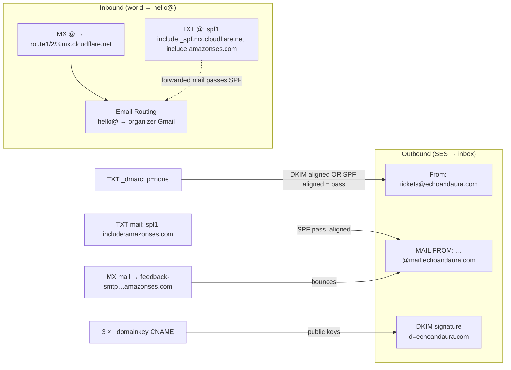

# Cloudflare

Status: ACTIVE · Owner: Evan · Last updated: 2026-10-02

Cloudflare holds the **domain** (registrar + authoritative DNS), receives
mail for `hello@` (**Email Routing**), holds event cover images
(**R2**), and checks for bots on the public forms
(**Turnstile**, ADR-048). It does not run the app. Every DNS record that
exists is in the table below — if a record is not here, it should not be
in the zone. `pnpm infra:check` resolves each one.

Sign-in: one account and one zone, owned by Raj's login (Bitwarden item
`Cloudflare`). Since 2026-10-03 the developer is a member with their own
login (Super Administrator, own 2FA): no shared password, and the audit
log shows who changed what. Both logins have 2FA.

---

## Domain

| Item        | Value                                                         |
| ----------- | ------------------------------------------------------------- |
| Zone        | `echoandaura.com`                                             |
| Registrar   | Cloudflare Registrar (auto-renew on; WHOIS redaction default) |
| Nameservers | `elisa.ns.cloudflare.com`, `vicky.ns.cloudflare.com`          |
| Plan        | Free                                                          |

## DNS — the authoritative record list

All mail records are **DNS only** (grey cloud). Proxying a DKIM CNAME or
an MX host breaks it silently. The app's own `A`/`AAAA` records arrive
with deployment (Phase 6) and are proxied, like `media` (R2).
`deploy`, the Dokploy dashboard, was DNS only until 2026-09-29. It is
proxied now (ADR-045): the server answers web traffic from Cloudflare
only, so a DNS-only record would lead nowhere. A WAF custom rule keeps
Cloudflare's challenges off `deploy`'s `/api/*`, where GitHub's deploy
call goes ([SERVER.md § 20](SERVER.md)). Traefik still renews its Let's
Encrypt certificate: the HTTP challenge arrives through Cloudflare.

| Type   | Name (relative)                               | Content                                                                | Proxy    | Owner / purpose                                                                                                                            |
| ------ | --------------------------------------------- | ---------------------------------------------------------------------- | -------- | ------------------------------------------------------------------------------------------------------------------------------------------ |
| CNAME  | `tiqho3f6k6gqjjucwewakfvqyjmiu46q._domainkey` | `tiqho3f6k6gqjjucwewakfvqyjmiu46q.dkim.amazonses.com`                  | DNS only | SES Easy DKIM (1 of 3) — signs outgoing mail                                                                                               |
| CNAME  | `bjtddvusgm23hci2bzarxllb7py7l7kk._domainkey` | `bjtddvusgm23hci2bzarxllb7py7l7kk.dkim.amazonses.com`                  | DNS only | SES Easy DKIM (2 of 3)                                                                                                                     |
| CNAME  | `tsrr3pkudaqmrgu7hdfft4camf656gro._domainkey` | `tsrr3pkudaqmrgu7hdfft4camf656gro.dkim.amazonses.com`                  | DNS only | SES Easy DKIM (3 of 3)                                                                                                                     |
| TXT    | `@`                                           | `v=spf1 include:_spf.mx.cloudflare.net include:amazonses.com ~all`     | —        | SPF for the root domain: Cloudflare Routing **and** SES. **One SPF record only** — merge, never add a second                               |
| TXT    | `@`                                           | `google-site-verification=S3DYisjK96_Pj68G62eYa0CZZ3q8k8pM1_e4FaRmDWU` | —        | Google Search Console owns the domain property (ADR-042). Bing imported the site from it. **Deleting it drops Search Console access**      |
| TXT    | `_dmarc`                                      | `v=DMARC1; p=none; rua=mailto:hello@echoandaura.com`                   | —        | DMARC policy; reports to `hello@`. Tighten to `p=quarantine` after a clean week (see runbook)                                              |
| MX     | `@`                                           | `route1.mx.cloudflare.net` (51), `route2…` (65), `route3…` (78)        | —        | Cloudflare Email Routing — inbound mail                                                                                                    |
| MX     | `mail`                                        | `feedback-smtp.ap-south-1.amazonses.com` (10)                          | —        | SES custom MAIL FROM — bounces return to SES                                                                                               |
| TXT    | `mail`                                        | `v=spf1 include:amazonses.com ~all`                                    | —        | SPF for the MAIL FROM subdomain (aligns SPF with the From domain)                                                                          |
| MX     | `cf-bounce`                                   | `route1.mx.cloudflare.net` (51), `route2…` (65), `route3…` (78)        | —        | Cloudflare Email Service bounces (ADR-057); added by Onboard Domain                                                                        |
| TXT    | `cf-bounce`                                   | `v=spf1 include:_spf.mx.cloudflare.net ~all`                           | —        | SPF for Cloudflare's envelope sender (aligns with the From domain)                                                                         |
| TXT    | `cf-bounce._domainkey`                        | `v=DKIM1; h=sha256; k=rsa; p=MIIBIjANBgkqh…` (2048-bit key)            | —        | Cloudflare Email Service DKIM — signs outgoing mail as `echoandaura.com`                                                                   |
| A/AAAA | `@`, `www`                                    | _not yet_ — Phase 6                                                    | Proxied  | the app                                                                                                                                    |
| A      | `deploy`                                      | `160.25.226.166`                                                       | Proxied  | the Dokploy dashboard and its API (GitHub's Deploy workflow calls it). Added 2026-09-27; proxied 2026-09-29 (ADR-045)                      |
| R2     | `media`                                       | the `echoandaura-media` bucket                                         | Proxied  | public covers and sponsor logos (`R2_PUBLIC_URL`). Created and managed by R2's Custom Domains; edit it there, not in DNS. Added 2026-09-27 |

Cloudflare also keeps a hidden `_cf-…` TXT for Email Routing ownership;
leave it.

### What authenticates what


```mermaid
flowchart LR
  subgraph out["Outbound (SES → inbox)"]
    from["From: tickets@echoandaura.com"]
    mf["MAIL FROM: …@mail.echoandaura.com"]
    dkim["DKIM signature\nd=echoandaura.com"]
  end
  cn["3 × _domainkey CNAME"] -->|public keys| dkim
  spfmail["TXT mail: spf1 include:amazonses.com"] -->|SPF pass, aligned| mf
  mxmail["MX mail → feedback-smtp…amazonses.com"] -->|bounces| mf
  dmarc["TXT _dmarc: p=none"] -->|DKIM aligned OR SPF aligned = pass| from
  subgraph in["Inbound (world → hello@)"]
    mxroot["MX @ → route1/2/3.mx.cloudflare.net"] --> routing["Email Routing\nhello@ → organizer Gmail"]
    spfroot["TXT @: spf1 include:_spf.mx.cloudflare.net include:amazonses.com"] -.->|forwarded mail passes SPF| routing
  end
```

- **DKIM** is what makes DMARC pass; it is signed by SES with keys the
  three CNAMEs publish. Losing a CNAME = Gmail spam folder within hours.
- **SPF on `@`** covers mail Cloudflare forwards _and_ SES; SES's own
  envelope sender is on `mail.`, which is why that subdomain has its own
  SPF and MX.
- **DMARC `p=none`** = report only. It still lets Gmail show "signed by
  echoandaura.com". `quarantine` is the goal once reports are clean.

## Email Routing

| Item      | Value                                                                                           |
| --------- | ----------------------------------------------------------------------------------------------- |
| Where     | Account home → **Compute → Email Service → Email Routing** (moved out of the zone menu in 2026) |
| Address   | `hello@echoandaura.com` → forwards to the organizer's Gmail (verified destination)              |
| Catch-all | not configured (add one if `support@`/`info@` mail starts arriving)                             |
| Used by   | `EMAIL_REPLY_TO`, `ORGANIZER_CONTACT_EMAIL`, DMARC `rua`                                        |

Replies to any app email land in Gmail with the buyer's address intact;
replying from Gmail goes out as Gmail, not as `hello@` (fine for now — a
"send as" alias needs SMTP, which SES can provide later).

## R2

Created 2026-09-27. R2 needs a payment method on the account even inside
the free tier (10 GB stored, free egress). Locally the same code talks to
**MinIO** from `docker-compose.yml`; only env vars differ (`R2_ENDPOINT`,
`R2_ACCESS_KEY_ID`, `R2_SECRET_ACCESS_KEY`, `R2_BUCKET`, `R2_PUBLIC_URL`).

Two buckets, each with its own key. The web app's key sits on a
public-facing server; if it leaked, it could touch covers but never the
backups.

| Item                                                                      | `echoandaura-media`                                                        | `echoandaura-backups`                                           |
| ------------------------------------------------------------------------- | -------------------------------------------------------------------------- | --------------------------------------------------------------- |
| Holds                                                                     | event covers, sponsor logos                                                | Postgres backups (Dokploy)                                      |
| Location                                                                  | automatic, hint Asia-Pacific; Standard class                               | same                                                            |
| Public access                                                             | custom domain `media.echoandaura.com` (proxied); `r2.dev` URL **disabled** | **none**: no custom domain, no `r2.dev`, no CORS                |
| CORS                                                                      | the policy below                                                           | none                                                            |
| Key (Account API token, Object Read & Write, this bucket only, no expiry) | `echoandaura-media-app` → Bitwarden `Cloudflare R2 token`                  | `echoandaura-backups` → Bitwarden `Cloudflare R2 backups token` |
| Used by                                                                   | web (presigned uploads, logo writes), worker                               | Dokploy's backup job                                            |

The endpoint for both is `https://<account-id>.r2.cloudflarestorage.com`,
without the bucket name (the app uses path-style addressing). It is kept in
Bitwarden with each key, not here.

**CORS on `echoandaura-media`.** The browser uploads a cover straight to
R2 with a presigned `PUT` (ADR-007), so R2 must accept that one request
from the site and nothing else:

```json
[
  {
    "AllowedOrigins": ["https://echoandaura.com"],
    "AllowedMethods": ["PUT"],
    "AllowedHeaders": ["Content-Type"],
    "MaxAgeSeconds": 3600
  }
]
```

The presigned URL is bound to the file's type and size and expires after
5 minutes; CORS is the second lock, not the only one. If `SITE_URL` ever
changes, change `AllowedOrigins` with it, or every cover upload fails in
the browser.

**Checked 2026-09-27** (from outside): a file by its exact name returns
`200` through Cloudflare; the bucket root and `?list-type=2` return `404`
(nobody can list it); an unsigned `PUT` returns `401`; the backups bucket
has no public name.

How uploads work end-to-end: [../systems/STORAGE.md](../systems/STORAGE.md)
(written with Phase 6) and ADR-007.

## Security rules (WAF)

Security → WAF → Custom rules. Free plan: up to 5 rules.

| Rule                         | Expression                                                                                | Action                                                                                     | Why                                                                                                                               |
| ---------------------------- | ----------------------------------------------------------------------------------------- | ------------------------------------------------------------------------------------------ | --------------------------------------------------------------------------------------------------------------------------------- |
| `deploy API - no challenges` | `(http.host eq "deploy.echoandaura.com" and starts_with(http.request.uri.path, "/api/"))` | Skip: remaining custom rules, Browser Integrity Check, Security Level, User Agent Blocking | GitHub's deploy call is a script, not a browser; a challenge would fail every deploy. Dokploy's API key still guards it (ADR-045) |

Two more rules (ADR-050), in this order below the skip rule:

| Rule                             | Expression                                                                                                                                                                                                                    | Action            | State                                     | Why                                                                                                                                                                          |
| -------------------------------- | ----------------------------------------------------------------------------------------------------------------------------------------------------------------------------------------------------------------------------- | ----------------- | ----------------------------------------- | ---------------------------------------------------------------------------------------------------------------------------------------------------------------------------- |
| `block scanners`                 | `(http.host eq "echoandaura.com" and (starts_with(http.request.uri.path, "/wp-") or ends_with(http.request.uri.path, ".php") or starts_with(http.request.uri.path, "/.env") or starts_with(http.request.uri.path, "/.git")))` | Block             | **on**                                    | Bots probing for WordPress, PHP and leaked files. The app has none of these; refusing them at the edge keeps them off the server and out of the logs                         |
| `emergency - outside Bangladesh` | `(http.host eq "echoandaura.com" and ip.src.country ne "BD" and not starts_with(http.request.uri.path, "/_next/"))`                                                                                                           | Managed Challenge | **off** (switch on only during an attack) | One click during a flood from abroad: visitors outside Bangladesh get a Cloudflare check first. [RUNBOOK → The site is under attack](../RUNBOOK.md#the-site-is-under-attack) |

Bot Fight Mode (Security → Bots) stays **off**: on the free plan it can't
be skipped for a path, and it would challenge the deploy call.

### Rate limiting (ADR-047)

Security → WAF → Rate limiting rules. Free plan: **one** rule, matching
on the URL path only (not the method or host), counted per IP over 10
seconds, blocking for 10 seconds.

| Rule                   | Expression                                            | Rate                        | Action         | Why                                                                                                                                     |
| ---------------------- | ----------------------------------------------------- | --------------------------- | -------------- | --------------------------------------------------------------------------------------------------------------------------------------- |
| `requests per address` | `(not starts_with(http.request.uri.path, "/_next/"))` | 150 requests / 10 s, per IP | Block for 10 s | One address flooding the site would take the server's in-flight budget (SERVER.md § 21) from everyone else; this refuses it at the edge |

- **What counts:** pages, link prefetches, form posts, `/api/*`, `/door`
  calls, on both hostnames. Everything under `/_next/` is left out:
  scripts and styles Cloudflare serves from cache, and resized covers
  Next serves from its own disk cache.
- **Why 150:** a person browsing makes a page request plus a few
  prefetches per link on screen, a few dozen per 10 s at most. Many
  buyers can share one address on a mobile network (CGNAT), so the limit
  sits well above one person. At 15 a second, one address uses a small
  share of the 100 requests in flight.
- **Blocked visitors** get Cloudflare's 429 page for 10 seconds, then
  are let back in.
- **Event night:** door phones and admins at the venue may share one
  address; scanning is about one request per scan, far under the limit.

## Cloudflare Access (ADR-050)

Zero Trust (free plan, up to 50 users) puts an email check **in front of**
the admin area and the Dokploy dashboard: Cloudflare asks for an email
address and sends a one-time code to it, and only listed addresses get
through. Behind it, the admin still signs in with password + 2FA
(ADR-049); Dokploy with its own login + 2FA.

| Setting          | Value                                                                                                                     |
| ---------------- | ------------------------------------------------------------------------------------------------------------------------- |
| Team domain      | `<team>.cloudflareaccess.com` (Zero Trust → Settings → Custom pages / General) → `CF_ACCESS_TEAM_DOMAIN`                  |
| Login method     | One-time PIN (email). Cloudflare sends it, not our SES                                                                    |
| App **Admin**    | Self-hosted, `echoandaura.com/admin` (covers everything under it). Session **1 week**                                     |
| Admin policy     | Allow — Emails: the developer and Raj (the addresses are in Bitwarden `Cloudflare Access`, not here: this repo is public) |
| Admin AUD tag    | App → Overview → Application Audience (AUD) Tag → `CF_ACCESS_AUD` in Dokploy                                              |
| App **Dokploy**  | Self-hosted, `deploy.echoandaura.com`. Session **1 week**                                                                 |
| Dokploy policies | Allow — Emails: the developer only. **Service Auth** — service token `github-deploy`                                      |
| Service token    | `github-deploy` → GitHub repo secrets `CF_ACCESS_CLIENT_ID` / `CF_ACCESS_CLIENT_SECRET` (+ Bitwarden)                     |

**Why the server checks too.** Origin lockdown (ADR-045) lets only
Cloudflare's addresses in, but they are shared with every Cloudflare
customer. With `CF_ACCESS_TEAM_DOMAIN` + `CF_ACCESS_AUD` set, the web
refuses any `/admin` request without a token signed for the Admin app
(`src/lib/cf-access.ts`). Empty = check off.

**Not behind Access:** `/door` (the gate scanner must work offline at the
venue with a gate pass), the public site, `/api/*`. Dokploy can't check
the token itself; its own login + 2FA stay.

### Set up (once)

In this order, so nothing locks out:

1. **Zero Trust** (dashboard sidebar) → choose a team name, e.g.
   `echoandaura` → **Free** plan (it may ask for the card already on file
   for R2; nothing is charged up to 50 users).
2. Settings → Authentication → Login methods → **One-time PIN** is there
   by default; keep it.
3. Access → Service auth → **Create service token** `github-deploy`,
   duration **Non-expiring** (or 1 year + a calendar reminder). Copy the
   Client ID and Secret once → Bitwarden `Cloudflare Access` → GitHub repo
   → Settings → Secrets → Actions: `CF_ACCESS_CLIENT_ID`,
   `CF_ACCESS_CLIENT_SECRET`.
4. Access → Applications → **Add** → Self-hosted → name `Dokploy`, domain
   `deploy.echoandaura.com`, session 1 week. Policies: `developer` (Allow,
   Emails = the developer's) and `github deploy` (**Service Auth**, service
   token `github-deploy`). Save. Then run Actions → Deploy → **Run
   workflow** once: it must still deploy.
5. Access → Applications → **Add** → Self-hosted → name `Admin`, domain
   `echoandaura.com`, path `admin`, session 1 week. Policy `admins`
   (Allow, Emails = the developer's and Raj's). Save. Open
   `https://echoandaura.com/admin` in a private window: Cloudflare's
   email page must come first.
6. Copy the Admin app's **AUD tag** and the team domain into Dokploy →
   Environment: `CF_ACCESS_AUD`, `CF_ACCESS_TEAM_DOMAIN` → **Deploy**.
   From now on the server refuses `/admin` without the Access token.

### Change it later

- **Add or remove an admin's email:** Access → Applications → `Admin` →
  Policies → `admins` → edit the Emails list → Save. Effective at once
  for new logins; to cut someone off immediately, also Zero Trust → My
  Team → Users → the user → **Revoke session**. Remember the admin
  account itself (`admin:create`, or removing the role) is separate.
- **Change who reaches Dokploy:** the same, on the `Dokploy` app's
  `developer` policy.
- **Session length:** Access → Applications → the app → Overview →
  Session Duration. Shorter = more email codes.
- **Rotate the service token:** Access → Service auth → `github-deploy` →
  Refresh → update both GitHub secrets + Bitwarden → Run workflow once.
- **Raj's or the developer's email changes:** add the new address
  first, sign in once, then remove the old one.

### Switch it off in an emergency

Access is broken or misconfigured and nobody gets into `/admin`: Dokploy
→ Environment → empty `CF_ACCESS_AUD` → **Deploy** (turns the server
check off), then fix or delete the `Admin` app in Zero Trust. Locked out
of Dokploy by its own Access app: Zero Trust → Access → Applications →
`Dokploy` → delete (or add your new email) — that page is behind the
Cloudflare account login, not Access.

## DNSSEC

DNS → Settings → DNSSEC → **Enable**. The registrar is Cloudflare too, so
the DS record is published for us; the status turns **Active** within
about an hour (`dig +short DS echoandaura.com` then answers). It signs
our DNS answers, so nobody can forge them on the way to a visitor (point
the site or the mail records elsewhere).

## Cache rules (ADR-056)

Public pages are served from the Cloudflare edge for 30 seconds to
visitors who are not signed in. Caching → Cache Rules →
`public pages for anonymous visitors`:

```
(http.host eq "echoandaura.com"
 and not http.cookie contains "better-auth"
 and (http.request.uri.path in {"/" "/events" "/archive" "/about" "/faq" "/terms" "/privacy" "/refund" "/contact"}
      or (starts_with(http.request.uri.path, "/events/")
          and not ends_with(http.request.uri.path, "/register"))))
```

- **Cache eligibility:** Eligible for cache
- **Edge TTL:** Ignore cache-control header and use this TTL, **30 seconds**;
  status code TTL **500-526 → No cache** (526 is the highest the free plan offers, and the highest Cloudflare uses) (an error page is never kept)
- **Browser TTL:** Respect origin TTL (browsers still get `no-store`)
- **Cache key:** default (the query string is part of it)

A page goes on this list only if it renders the same for every anonymous
visitor and sets no cookie (ADR-056; `tests/e2e/public-edge-cache.spec.ts`
checks the cookie half). Never add `/register`, `/orders`, `/tickets`,
`/account`, `/admin`, `/door` or `/api`.

**Check it:** `curl -sI https://echoandaura.com/faq | grep -i cf-cache-status`
twice: `MISS` (or `EXPIRED`) then `HIT`. With
`-H 'Cookie: better-auth.x=1'`: `DYNAMIC`.

**Switch it off:** toggle the rule off. Nothing in the app depends on it;
pages go back to ~170 ms first byte.

## Gate relay (ADR-058)

The Worker `echoandaura-relay` at `relay.echoandaura.com`: one Durable
Object room per event that passes check-ins between door phones live, and
keeps doing so when our server is down. Code and config in `relay/`
(`wrangler.toml`). Needs Workers Paid (bought 2026-10-04). Deployed by
hand, never by CI.

**Set up (once):**

1. `pnpm exec wrangler login`: the browser opens; sign in as yourself and
   allow. (Only your laptop holds this login.)
2. `pnpm relay:deploy`: uploads the Worker, creates the room class, and
   attaches the custom domain `relay.echoandaura.com` (Cloudflare adds its
   DNS record and certificate itself).
3. Make the shared secret and keep it in Bitwarden as **`Gate relay
secret`**: `openssl rand -base64 48 | tr -d '\n/+=' | cut -c1-48`.
4. Give it to the Worker: `pnpm exec wrangler secret put RELAY_SECRET -c
relay/wrangler.toml`, then paste it. It applies at once.
5. Give the same secret to the app: Dokploy → the compose app →
   Environment: `RELAY_URL=https://relay.echoandaura.com` and
   `RELAY_SECRET=<the same>` → Deploy. (The compose file passes both to the
   web, which signs passes, and the worker, which delivers announcements.)

**Check it:** `curl https://relay.echoandaura.com/health` says `ok`; a
door phone shows **Live** next to the count within a few seconds.

**Change the code:** merge, then `pnpm relay:deploy` again — never during
an event: a change to the room's tables rebuilds every room empty. Phones
reconnect by themselves and re-send what they claimed.

**Logs:** the relay's invocation logs are off (`wrangler.toml`): a door
phone's pass rides in a request header and must not land in Cloudflare's
logs. Errors still show in Workers → `echoandaura-relay` → Logs.

**Rotate the secret:** new secret in Bitwarden → step 4 → step 5. Phones
reconnect with the pass from their next list download (within a minute);
until then they fall back to the status ping.

**Switch it off:** remove `RELAY_URL` and `RELAY_SECRET` in Dokploy and
deploy. The door works as before ADR-058, sharing by the ping alone. The
Worker can stay, unused.

## Email Address Obfuscation: keep it off

Security → Settings → Email Address Obfuscation is **off** (2026-10-04).
When on, Cloudflare rewrites addresses in the HTML and injects a decoder
script: our CSP blocks the script, and the rewritten HTML no longer
matches what React renders, so every page fails hydration (React #418).
It hid nothing either: the address is plain in the page's RSC data.

## Turnstile

The bot check on five public forms: registration, Find my order, buyer
sign-in, admin login, admin forgot password (ADR-048), on the free
plan. The browser solves a challenge from Cloudflare's script; the
web sends the token to siteverify with the secret before doing anything.

| Item          | Value                                                                                   |
| ------------- | --------------------------------------------------------------------------------------- |
| Widget        | `echoandaura forms`                                                                     |
| Hostnames     | `echoandaura.com` (the server also checks the solved-on host against `SITE_URL`'s host) |
| Mode          | Managed (the widget renders `interaction-only`: most visitors never see it)             |
| Pre-clearance | No                                                                                      |
| Keys          | Bitwarden `Cloudflare Turnstile` → Dokploy, the compose app's Environment               |
| Used by       | web only: `TURNSTILE_SITE_KEY` (public, sent to every browser), `TURNSTILE_SECRET_KEY`  |

**Create the widget (once).** Cloudflare dashboard → **Turnstile** (in
the account menu; search "Turnstile" if it has moved) → **Add widget**:

1. Widget name `echoandaura forms`.
2. Hostname management → add `echoandaura.com`. Not `localhost`: dev and
   the e2e suite use Cloudflare's test keys, which need no widget.
3. Widget mode **Managed**.
4. Pre-clearance **No**: the forms check their own token; a clearance
   cookie for the rest of the site would add nothing.
5. **Create**, then copy the **Site Key** and **Secret Key** into a new
   Bitwarden item `Cloudflare Turnstile`.
6. Dokploy → the compose app → Environment → `TURNSTILE_SITE_KEY` and
   `TURNSTILE_SECRET_KEY` → save. Both must be there **before** the
   change that reads them is merged ([DEPLOY.md](../DEPLOY.md)), or the
   deploy fails.

Analytics (Turnstile → the widget) show solves and failures per hostname
and action; the action names are in `TURNSTILE_ACTIONS`
(`src/lib/turnstile-config.ts`).

## Runbooks

### Add or change a DNS record

Zone → DNS → Records. Type the **relative** name (`mail`, not
`mail.echoandaura.com` — either is accepted, but be consistent). Mail
records: proxy off. Then update the table above in the same commit and
run `pnpm infra:check` — `dig` sees Cloudflare changes within a minute.

### Tighten DMARC (after ~1 week of sending)

Zone → **Email → DMARC Management** shows per-source pass/fail from the
reports arriving at `hello@`. When every source is SES/Cloudflare and
passing: edit the `_dmarc` TXT to `v=DMARC1; p=quarantine; rua=mailto:hello@echoandaura.com`.
Later `p=reject`. Never set `reject` on the same day as a DNS change.

### SES re-verification (new DKIM tokens)

Only if the SES identity is deleted and recreated (new region/account):
SES shows three new tokens → add three new CNAMEs, wait for Verified,
then delete the old three. Same for MAIL FROM if the region changes
(the MX host is region-specific).

### Rotate an R2 key

R2 → Manage API tokens → create a new Account API token with the same
scope (Object Read & Write, that one bucket) → update Bitwarden →

- **media key:** Dokploy → the compose app → Environment →
  `R2_ACCESS_KEY_ID` / `R2_SECRET_ACCESS_KEY` → Deploy → upload a cover in
  the admin to prove it;
- **backups key:** Dokploy → Settings → S3 Destinations → the R2 entry →
  Test → run a manual backup;

→ then delete the old token.

### Rotate the Turnstile secret

Turnstile → `echoandaura forms` → Settings → **Rotate secret key**
(Cloudflare keeps the old one valid for a short while; it says how
long) → update Bitwarden `Cloudflare Turnstile` → Dokploy → the compose
app → Environment → `TURNSTILE_SECRET_KEY` → **Deploy** → send Find my
order with a made-up reference (`EA-7K3M9Q`) and any valid mobile: it
must say no order matches, not the bot message. The site key does not change.

### Lose access to the Cloudflare account

Registrar transfer lock is on and the domain auto-renews from the card on
the account; losing the login does not lose the domain. Recovery is via
Cloudflare's account recovery with the 2FA backup codes in Bitwarden.

## Verify

```bash
dig +short NS echoandaura.com                                  # elisa/vicky.ns.cloudflare.com
dig +short CNAME tiqho3f6k6gqjjucwewakfvqyjmiu46q._domainkey.echoandaura.com   # …dkim.amazonses.com
dig +short TXT echoandaura.com | grep spf1                      # exactly one line
dig +short TXT _dmarc.echoandaura.com
dig +short MX echoandaura.com                                   # three route*.mx.cloudflare.net
dig +short MX mail.echoandaura.com                              # feedback-smtp.ap-south-1.amazonses.com
dig +short TXT mail.echoandaura.com
dig +short A deploy.echoandaura.com                             # Cloudflare addresses (proxied), never 160.25.226.166
curl -s -o /dev/null -w '%{http_code}\n' https://media.echoandaura.com/            # 404: the bucket can't be listed
curl -s -o /dev/null -w '%{http_code}\n' -X PUT -d x https://media.echoandaura.com/x # 401: no unsigned uploads
```

and a mail to `hello@echoandaura.com` from any outside account arrives in
the organizer's Gmail within a minute.

## Search engines

The app serves `robots.txt`, `sitemap.xml` and structured data itself
(ADR-042). Two things live outside the code:

- **Cloudflare's managed robots.txt** (Security → Bots, or AI Crawl
  Control, depending on the dashboard version) was serving a
  comments-only `robots.txt` before the app had one. With it on,
  Cloudflare adds its content-signals comments to ours. Check that
  `https://echoandaura.com/robots.txt` shows the app's `Disallow` lines
  and the `Sitemap:` line.
- **Google Search Console** (done 2026-09-29): a Domain property for
  `echoandaura.com`, verified by the `google-site-verification` TXT on
  `@` (record table above). The sitemap `https://echoandaura.com/sitemap.xml`
  was submitted, with status Success.
- **Bing Webmaster Tools** (done 2026-09-29): imported from Search
  Console, verification and sitemap included. Bing's index also feeds
  Copilot and DuckDuckGo.
- **When an event is published:** it joins the sitemap on its own. For
  faster indexing, use Search Console → URL Inspection → Request
  indexing. Check it with the Rich Results Test
  (https://search.google.com/test/rich-results), which should find an
  Event with its offers.

## History

| Date       | Change                                                                                                                                                                                                                                                                                                                                                                                                                                                                             |
| ---------- | ---------------------------------------------------------------------------------------------------------------------------------------------------------------------------------------------------------------------------------------------------------------------------------------------------------------------------------------------------------------------------------------------------------------------------------------------------------------------------------- |
| 2026-09-20 | DKIM CNAMEs, SPF (merged Cloudflare + SES), DMARC `p=none`, MAIL FROM MX/TXT, Email Routing `hello@`                                                                                                                                                                                                                                                                                                                                                                               |
| 2026-09-27 | `deploy` A record (DNS only) for the Dokploy dashboard                                                                                                                                                                                                                                                                                                                                                                                                                             |
| 2026-09-27 | R2 on (payment method added): buckets `echoandaura-media` (public at `media.`, CORS for presigned PUT) and `echoandaura-backups` (private), one scoped key each                                                                                                                                                                                                                                                                                                                    |
| 2026-09-29 | Google Search Console verification TXT on `@`; sitemap submitted to Google, Bing imported from it (ADR-042)                                                                                                                                                                                                                                                                                                                                                                        |
| 2026-09-30 | WAF custom rule `deploy API - no challenges` (skip for `deploy` `/api/*`); `deploy` A record proxied; Bot Fight Mode confirmed off (ADR-045)                                                                                                                                                                                                                                                                                                                                       |
| 2026-09-30 | Rate limiting rule `requests per address`: path not under `/_next/`, 150 requests / 10 s per IP, block 10 s (the free plan's one rule, ADR-047)                                                                                                                                                                                                                                                                                                                                    |
| 2026-10-02 | Turnstile widget `echoandaura forms` (`echoandaura.com`, Managed, no pre-clearance), keys in Bitwarden + Dokploy (ADR-048)                                                                                                                                                                                                                                                                                                                                                         |
| 2026-10-03 | Zero Trust team `echoandaura.cloudflareaccess.com`; identity provider One-time PIN (apps use it only, instant auth); service token `github-deploy` → GitHub secrets; Access app `Dokploy` (`deploy.echoandaura.com`, policies `developer` + `github deploy`, 1 week; a Run workflow deploy got through); Access app `Admin` (`echoandaura.com/admin`, policy `admins`, 1 week); `CF_ACCESS_TEAM_DOMAIN` + `CF_ACCESS_AUD` in Dokploy → origin check on, sign-in verified (ADR-050) |
| 2026-10-03 | WAF `block scanners` (on, probes answer 403) and `emergency - outside Bangladesh` (off); DNSSEC enabled; DS record published the same day (`dig +short DS echoandaura.com` answers, key tag 2371)                                                                                                                                                                                                                                                                                  |
| 2026-10-03 | Members: developer added with their own login (Super Administrator) instead of sharing Raj's; both logins 2FA; API tokens reviewed (S4)                                                                                                                                                                                                                                                                                                                                            |
| 2026-10-04 | Cache rule `spike - cache faq for anonymous visitors` (`/faq`, no `better-auth` cookie, edge TTL 30 s): MISS → HIT, ~170 → ~50 ms first byte, CSP and navigation fine                                                                                                                                                                                                                                                                                                              |
| 2026-10-04 | Email Address Obfuscation off: the address was already plain in the RSC data, and the injected decoder broke CSP and hydration (React #418)                                                                                                                                                                                                                                                                                                                                        |
| 2026-10-04 | Cache rule widened and renamed `public pages for anonymous visitors` (ADR-056 expression; 500-526 no cache): all nine pages MISS → HIT, `/events/<slug>` cached, `/register`, `/orders`, `/account`, `/api` and any `better-auth` cookie DYNAMIC                                                                                                                                                                                                                                   |
| 2026-10-04 | Email Sending: Onboard Domain `echoandaura.com` (top level, no subdomain): `cf-bounce` MX ×3, SPF, DKIM added; the proposed `_dmarc` `p=reject` did **not** replace ours (`p=none` + `rua` kept, checked on the authoritative NS). Reputation Healthy, sending Enabled (ADR-057)                                                                                                                                                                                                   |
| 2026-10-05 | Email Sending live: account API token `echoandaura-worker-email` (Email Sending Edit, IPs `160.25.226.166` + `2001:df3:ad40::/48`). First send (sign-in link to a never-SES-verified Gmail): delivered in 12 s, SPF/DKIM (`echoandaura.com`)/DMARC **PASS**; landed in spam (new sending reputation)                                                                                                                                                                               |
