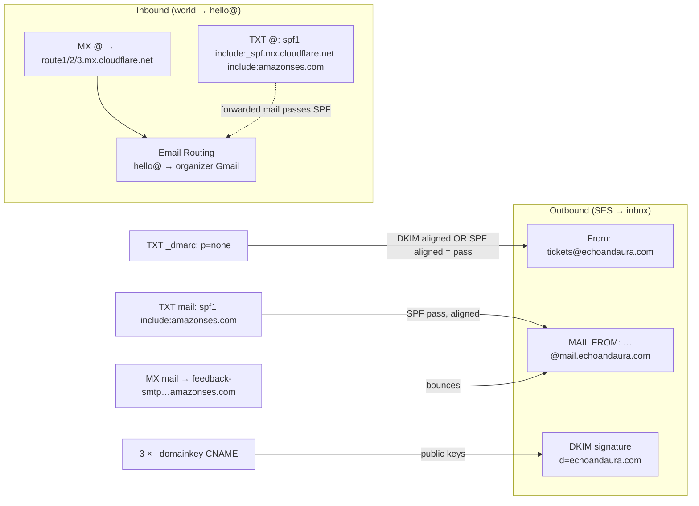

# Cloudflare

Status: ACTIVE · Owner: Evan · Last updated: 2026-09-27

Cloudflare holds the **domain** (registrar + authoritative DNS), receives
mail for `hello@` (**Email Routing**), and will hold event cover images
(**R2**, from Phase 6). It does not run the app. Every DNS record that
exists is in the table below — if a record is not here, it should not be
in the zone. `pnpm infra:check` resolves each one.

Sign-in: Bitwarden item `Cloudflare`. 2FA is on. There is one account
and one zone; no API tokens exist yet (R2 will add one).

---

## Domain

| Item        | Value                                                         |
| ----------- | ------------------------------------------------------------- |
| Zone        | `echoandaura.com`                                             |
| Registrar   | Cloudflare Registrar (auto-renew on; WHOIS redaction default) |
| Nameservers | `elisa.ns.cloudflare.com`, `vicky.ns.cloudflare.com`          |
| Plan        | Free                                                          |

## DNS — the authoritative record list

All mail records are **DNS only** (grey cloud). Proxying a DKIM CNAME or
an MX host breaks it silently. The app's own `A`/`AAAA` records arrive
with deployment (Phase 6) and are proxied, like `media` (R2).
`deploy`, the Dokploy dashboard, was DNS only until 2026-09-29. It is
proxied now (ADR-045): the server answers web traffic from Cloudflare
only, so a DNS-only record would lead nowhere. A WAF custom rule keeps
Cloudflare's challenges off `deploy`'s `/api/*`, where GitHub's deploy
call goes ([SERVER.md § 20](SERVER.md)). Traefik still renews its Let's
Encrypt certificate: the HTTP challenge arrives through Cloudflare.

| Type   | Name (relative)                               | Content                                                                | Proxy    | Owner / purpose                                                                                                                            |
| ------ | --------------------------------------------- | ---------------------------------------------------------------------- | -------- | ------------------------------------------------------------------------------------------------------------------------------------------ |
| CNAME  | `tiqho3f6k6gqjjucwewakfvqyjmiu46q._domainkey` | `tiqho3f6k6gqjjucwewakfvqyjmiu46q.dkim.amazonses.com`                  | DNS only | SES Easy DKIM (1 of 3) — signs outgoing mail                                                                                               |
| CNAME  | `bjtddvusgm23hci2bzarxllb7py7l7kk._domainkey` | `bjtddvusgm23hci2bzarxllb7py7l7kk.dkim.amazonses.com`                  | DNS only | SES Easy DKIM (2 of 3)                                                                                                                     |
| CNAME  | `tsrr3pkudaqmrgu7hdfft4camf656gro._domainkey` | `tsrr3pkudaqmrgu7hdfft4camf656gro.dkim.amazonses.com`                  | DNS only | SES Easy DKIM (3 of 3)                                                                                                                     |
| TXT    | `@`                                           | `v=spf1 include:_spf.mx.cloudflare.net include:amazonses.com ~all`     | —        | SPF for the root domain: Cloudflare Routing **and** SES. **One SPF record only** — merge, never add a second                               |
| TXT    | `@`                                           | `google-site-verification=S3DYisjK96_Pj68G62eYa0CZZ3q8k8pM1_e4FaRmDWU` | —        | Google Search Console owns the domain property (ADR-042). Bing imported the site from it. **Deleting it drops Search Console access**      |
| TXT    | `_dmarc`                                      | `v=DMARC1; p=none; rua=mailto:hello@echoandaura.com`                   | —        | DMARC policy; reports to `hello@`. Tighten to `p=quarantine` after a clean week (see runbook)                                              |
| MX     | `@`                                           | `route1.mx.cloudflare.net` (51), `route2…` (65), `route3…` (78)        | —        | Cloudflare Email Routing — inbound mail                                                                                                    |
| MX     | `mail`                                        | `feedback-smtp.ap-south-1.amazonses.com` (10)                          | —        | SES custom MAIL FROM — bounces return to SES                                                                                               |
| TXT    | `mail`                                        | `v=spf1 include:amazonses.com ~all`                                    | —        | SPF for the MAIL FROM subdomain (aligns SPF with the From domain)                                                                          |
| A/AAAA | `@`, `www`                                    | _not yet_ — Phase 6                                                    | Proxied  | the app                                                                                                                                    |
| A      | `deploy`                                      | `160.25.226.166`                                                       | Proxied  | the Dokploy dashboard and its API (GitHub's Deploy workflow calls it). Added 2026-09-27; proxied 2026-09-29 (ADR-045)                      |
| R2     | `media`                                       | the `echoandaura-media` bucket                                         | Proxied  | public covers and sponsor logos (`R2_PUBLIC_URL`). Created and managed by R2's Custom Domains; edit it there, not in DNS. Added 2026-09-27 |

Cloudflare also keeps a hidden `_cf-…` TXT for Email Routing ownership;
leave it.

### What authenticates what


```mermaid
flowchart LR
  subgraph out["Outbound (SES → inbox)"]
    from["From: tickets@echoandaura.com"]
    mf["MAIL FROM: …@mail.echoandaura.com"]
    dkim["DKIM signature\nd=echoandaura.com"]
  end
  cn["3 × _domainkey CNAME"] -->|public keys| dkim
  spfmail["TXT mail: spf1 include:amazonses.com"] -->|SPF pass, aligned| mf
  mxmail["MX mail → feedback-smtp…amazonses.com"] -->|bounces| mf
  dmarc["TXT _dmarc: p=none"] -->|DKIM aligned OR SPF aligned = pass| from
  subgraph in["Inbound (world → hello@)"]
    mxroot["MX @ → route1/2/3.mx.cloudflare.net"] --> routing["Email Routing\nhello@ → organizer Gmail"]
    spfroot["TXT @: spf1 include:_spf.mx.cloudflare.net include:amazonses.com"] -.->|forwarded mail passes SPF| routing
  end
```

- **DKIM** is what makes DMARC pass; it is signed by SES with keys the
  three CNAMEs publish. Losing a CNAME = Gmail spam folder within hours.
- **SPF on `@`** covers mail Cloudflare forwards _and_ SES; SES's own
  envelope sender is on `mail.`, which is why that subdomain has its own
  SPF and MX.
- **DMARC `p=none`** = report only. It still lets Gmail show "signed by
  echoandaura.com". `quarantine` is the goal once reports are clean.

## Email Routing

| Item      | Value                                                                                           |
| --------- | ----------------------------------------------------------------------------------------------- |
| Where     | Account home → **Compute → Email Service → Email Routing** (moved out of the zone menu in 2026) |
| Address   | `hello@echoandaura.com` → forwards to the organizer's Gmail (verified destination)              |
| Catch-all | not configured (add one if `support@`/`info@` mail starts arriving)                             |
| Used by   | `EMAIL_REPLY_TO`, `ORGANIZER_CONTACT_EMAIL`, DMARC `rua`                                        |

Replies to any app email land in Gmail with the buyer's address intact;
replying from Gmail goes out as Gmail, not as `hello@` (fine for now — a
"send as" alias needs SMTP, which SES can provide later).

## R2

Created 2026-09-27. R2 needs a payment method on the account even inside
the free tier (10 GB stored, free egress). Locally the same code talks to
**MinIO** from `docker-compose.yml`; only env vars differ (`R2_ENDPOINT`,
`R2_ACCESS_KEY_ID`, `R2_SECRET_ACCESS_KEY`, `R2_BUCKET`, `R2_PUBLIC_URL`).

Two buckets, each with its own key. The web app's key sits on a
public-facing server; if it leaked, it could touch covers but never the
backups.

| Item                                                                      | `echoandaura-media`                                                        | `echoandaura-backups`                                           |
| ------------------------------------------------------------------------- | -------------------------------------------------------------------------- | --------------------------------------------------------------- |
| Holds                                                                     | event covers, sponsor logos                                                | Postgres backups (Dokploy)                                      |
| Location                                                                  | automatic, hint Asia-Pacific; Standard class                               | same                                                            |
| Public access                                                             | custom domain `media.echoandaura.com` (proxied); `r2.dev` URL **disabled** | **none**: no custom domain, no `r2.dev`, no CORS                |
| CORS                                                                      | the policy below                                                           | none                                                            |
| Key (Account API token, Object Read & Write, this bucket only, no expiry) | `echoandaura-media-app` → Bitwarden `Cloudflare R2 token`                  | `echoandaura-backups` → Bitwarden `Cloudflare R2 backups token` |
| Used by                                                                   | web (presigned uploads, logo writes), worker                               | Dokploy's backup job                                            |

The endpoint for both is `https://<account-id>.r2.cloudflarestorage.com`,
without the bucket name (the app uses path-style addressing). It is kept in
Bitwarden with each key, not here.

**CORS on `echoandaura-media`.** The browser uploads a cover straight to
R2 with a presigned `PUT` (ADR-007), so R2 must accept that one request
from the site and nothing else:

```json
[
  {
    "AllowedOrigins": ["https://echoandaura.com"],
    "AllowedMethods": ["PUT"],
    "AllowedHeaders": ["Content-Type"],
    "MaxAgeSeconds": 3600
  }
]
```

The presigned URL is bound to the file's type and size and expires after
5 minutes; CORS is the second lock, not the only one. If `SITE_URL` ever
changes, change `AllowedOrigins` with it, or every cover upload fails in
the browser.

**Checked 2026-09-27** (from outside): a file by its exact name returns
`200` through Cloudflare; the bucket root and `?list-type=2` return `404`
(nobody can list it); an unsigned `PUT` returns `401`; the backups bucket
has no public name.

How uploads work end-to-end: [../systems/STORAGE.md](../systems/STORAGE.md)
(written with Phase 6) and ADR-007.

## Security rules (WAF)

Security → WAF → Custom rules. Free plan: up to 5 rules.

| Rule                         | Expression                                                                                | Action                                                                                     | Why                                                                                                                               |
| ---------------------------- | ----------------------------------------------------------------------------------------- | ------------------------------------------------------------------------------------------ | --------------------------------------------------------------------------------------------------------------------------------- |
| `deploy API - no challenges` | `(http.host eq "deploy.echoandaura.com" and starts_with(http.request.uri.path, "/api/"))` | Skip: remaining custom rules, Browser Integrity Check, Security Level, User Agent Blocking | GitHub's deploy call is a script, not a browser; a challenge would fail every deploy. Dokploy's API key still guards it (ADR-045) |

Bot Fight Mode (Security → Bots) stays **off**: on the free plan it can't
be skipped for a path, and it would challenge the deploy call.

## Runbooks

### Add or change a DNS record

Zone → DNS → Records. Type the **relative** name (`mail`, not
`mail.echoandaura.com` — either is accepted, but be consistent). Mail
records: proxy off. Then update the table above in the same commit and
run `pnpm infra:check` — `dig` sees Cloudflare changes within a minute.

### Tighten DMARC (after ~1 week of sending)

Zone → **Email → DMARC Management** shows per-source pass/fail from the
reports arriving at `hello@`. When every source is SES/Cloudflare and
passing: edit the `_dmarc` TXT to `v=DMARC1; p=quarantine; rua=mailto:hello@echoandaura.com`.
Later `p=reject`. Never set `reject` on the same day as a DNS change.

### SES re-verification (new DKIM tokens)

Only if the SES identity is deleted and recreated (new region/account):
SES shows three new tokens → add three new CNAMEs, wait for Verified,
then delete the old three. Same for MAIL FROM if the region changes
(the MX host is region-specific).

### Rotate an R2 key

R2 → Manage API tokens → create a new Account API token with the same
scope (Object Read & Write, that one bucket) → update Bitwarden →

- **media key:** Dokploy → the compose app → Environment →
  `R2_ACCESS_KEY_ID` / `R2_SECRET_ACCESS_KEY` → Deploy → upload a cover in
  the admin to prove it;
- **backups key:** Dokploy → Settings → S3 Destinations → the R2 entry →
  Test → run a manual backup;

→ then delete the old token.

### Lose access to the Cloudflare account

Registrar transfer lock is on and the domain auto-renews from the card on
the account; losing the login does not lose the domain. Recovery is via
Cloudflare's account recovery with the 2FA backup codes in Bitwarden.

## Verify

```bash
dig +short NS echoandaura.com                                  # elisa/vicky.ns.cloudflare.com
dig +short CNAME tiqho3f6k6gqjjucwewakfvqyjmiu46q._domainkey.echoandaura.com   # …dkim.amazonses.com
dig +short TXT echoandaura.com | grep spf1                      # exactly one line
dig +short TXT _dmarc.echoandaura.com
dig +short MX echoandaura.com                                   # three route*.mx.cloudflare.net
dig +short MX mail.echoandaura.com                              # feedback-smtp.ap-south-1.amazonses.com
dig +short TXT mail.echoandaura.com
dig +short A deploy.echoandaura.com                             # Cloudflare addresses (proxied), never 160.25.226.166
curl -s -o /dev/null -w '%{http_code}\n' https://media.echoandaura.com/            # 404: the bucket can't be listed
curl -s -o /dev/null -w '%{http_code}\n' -X PUT -d x https://media.echoandaura.com/x # 401: no unsigned uploads
```

and a mail to `hello@echoandaura.com` from any outside account arrives in
the organizer's Gmail within a minute.

## Search engines

The app serves `robots.txt`, `sitemap.xml` and structured data itself
(ADR-042). Two things live outside the code:

- **Cloudflare's managed robots.txt** (Security → Bots, or AI Crawl
  Control, depending on the dashboard version) was serving a
  comments-only `robots.txt` before the app had one. With it on,
  Cloudflare adds its content-signals comments to ours. Check that
  `https://echoandaura.com/robots.txt` shows the app's `Disallow` lines
  and the `Sitemap:` line.
- **Google Search Console** (done 2026-09-29): a Domain property for
  `echoandaura.com`, verified by the `google-site-verification` TXT on
  `@` (record table above). The sitemap `https://echoandaura.com/sitemap.xml`
  was submitted, with status Success.
- **Bing Webmaster Tools** (done 2026-09-29): imported from Search
  Console, verification and sitemap included. Bing's index also feeds
  Copilot and DuckDuckGo.
- **When an event is published:** it joins the sitemap on its own. For
  faster indexing, use Search Console → URL Inspection → Request
  indexing. Check it with the Rich Results Test
  (https://search.google.com/test/rich-results), which should find an
  Event with its offers.

## History

| Date       | Change                                                                                                                                                          |
| ---------- | --------------------------------------------------------------------------------------------------------------------------------------------------------------- |
| 2026-09-20 | DKIM CNAMEs, SPF (merged Cloudflare + SES), DMARC `p=none`, MAIL FROM MX/TXT, Email Routing `hello@`                                                            |
| 2026-09-27 | `deploy` A record (DNS only) for the Dokploy dashboard                                                                                                          |
| 2026-09-27 | R2 on (payment method added): buckets `echoandaura-media` (public at `media.`, CORS for presigned PUT) and `echoandaura-backups` (private), one scoped key each |
| 2026-09-29 | Google Search Console verification TXT on `@`; sitemap submitted to Google, Bing imported from it (ADR-042)                                                     |
| 2026-09-30 | WAF custom rule `deploy API - no challenges` (skip for `deploy` `/api/*`); `deploy` A record proxied; Bot Fight Mode confirmed off (ADR-045)                    |
