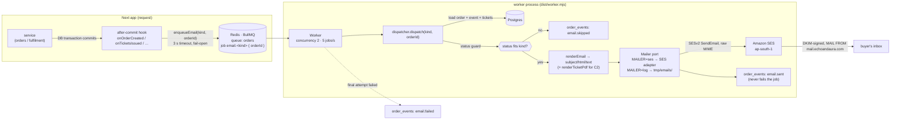

# Email — how a message gets from an order to an inbox

Status: ACTIVE · Owner: Evan · Last updated: 2026-09-20

Five kinds of email leave the system, all transactional, all sent by the
**worker** process through **Amazon SES**. The Next app never talks to
SES: it writes a job to Redis after the database commit, and the worker
does the rest. This page is the whole path, the failure modes, and the
"an email did not arrive" procedure. Provider setup is in
[../infra/AWS.md](../infra/AWS.md); DNS in
[../infra/CLOUDFLARE.md](../infra/CLOUDFLARE.md); the decision record is
ADR-016 (and ADR-014 for the hooks, ADR-017 for the sign-in link).

---

## The five emails

| Kind (`EmailKind`)     | Design | Trigger (after-commit hook in `src/server/container.ts`)                       | Sent only if order is                                       | Attachment       | Template                             |
| ---------------------- | ------ | ------------------------------------------------------------------------------ | ----------------------------------------------------------- | ---------------- | ------------------------------------ |
| `payment-instructions` | C1     | `onOrderCreated` — registration committed                                      | `pending_payment` / `pending_verification`, hold not lapsed | —                | `templates/payment-instructions.tsx` |
| `tickets-issued`       | C2     | `onTicketsIssued` — admin approved; `onTicketsResendRequested` — admin re-send | `issued`                                                    | tickets PDF (C5) | `templates/tickets-issued.tsx`       |
| `rejected`             | C3     | `onOrderRejected` — admin rejected                                             | `rejected`                                                  | —                | `templates/rejected.tsx`             |
| `expired`              | C4     | `onOrderExpired` — the worker's `expire-holds` job (every 60 s)                | `expired`                                                   | —                | `templates/expired.tsx`              |
| sign-in link           | C6     | better-auth `magicLink` plugin → `sendMagicLink` → `enqueueSignInEmail`        | n/a (no order; skipped for admin emails)                    | —                | `templates/sign-in.tsx`              |

Every template is React Email (`src/server/email/templates/`), rendered
to HTML **and** plain text. `pnpm email:render` writes all of them to
`tmp/emails/` from sample data for eyeballing.

## The pipeline



Step by step:

1. **A service commits.** Order creation, approve, reject and expiry each
   run one DB transaction. Nothing network-bound happens inside it
   (Invariant 7).
2. **The after-commit hook enqueues.** `enqueueEmail` puts
   `email.<kind>` with `{ orderId }` on the BullMQ queue `orders`. The
   **job id is deterministic** (`<kind>__<orderId>`), so a double hook or
   a retried request collapses into one job; a re-send asks for a fresh id
   with a timestamp. The producer's Redis connection fails fast (2 s
   connect, no offline queue) and the call is raced against a 3 s timeout:
   **if Redis is down the order still stands** and the hook logs an error —
   the admin can re-send later.
3. **The worker picks it up** (`src/worker.ts`, bundled with esbuild to
   `dist/worker.mjs`, run by plain `node` — `pnpm worker`). Concurrency 2,
   rate-limited to 5 jobs/s; SES's default production rate is 14/s and the
   sandbox 1/s.
4. **The dispatcher** (`src/server/email/dispatch.ts`) loads the order and
   applies the **status guard**: C1 only for an order still awaiting money
   (and not past its hold deadline), C2 only for `issued`, etc. Anything
   else writes `email.skipped` and returns — a stale job can never send a
   misleading email. It then renders the template, attaches the PDF for
   C2, and hands an `OutgoingEmail` to the mailer.
5. **The Mailer port** (`src/server/email/mailer.ts`) has two adapters,
   chosen by `MAILER` (`select.ts`): `ses` builds raw MIME with
   nodemailer's MailComposer (attachments need raw) and calls SESv2
   `SendEmail`; `log` writes `.html`/`.txt`/attachments to `tmp/emails/`.
   Production **refuses** `log`.
6. **Audit.** After a successful send the dispatcher inserts
   `order_events` row `email.sent` (`<kind> → <address> · <SES message id>`).
   That insert is wrapped so a DB hiccup after the send cannot fail the
   job — a retry would send twice.
7. **SES → inbox.** SES signs with DKIM (`d=echoandaura.com`), uses
   `mail.echoandaura.com` as the envelope sender, and the receiving side
   checks DKIM/SPF/DMARC against the DNS records in CLOUDFLARE.md.

The sign-in link (C6) takes the same road with job name `auth.sign-in`
and `{ to, url }`, no order, no audit row (only a log line), and
`removeOnComplete: true` because the URL is a bearer token.

### Retries and errors

| What SES says                                                                                | Adapter throws         | Worker does                                                    |
| -------------------------------------------------------------------------------------------- | ---------------------- | -------------------------------------------------------------- |
| `Throttling`, `TooManyRequests`, `SendingPaused`, `LimitExceeded`                            | `MailerThrottledError` | retry: 5 attempts, exponential backoff 30 s → 60 s → 2 → 4 min |
| `MessageRejected`, `MailFromDomainNotVerified`, `AccountSuspended`, `BadRequest`, `NotFound` | `MailerPermanentError` | `UnrecoverableError` — no retry, `email.failed` audit row      |
| anything else (network, `AccessDenied`)                                                      | the raw error          | retry as above; `email.failed` after the last attempt          |
| order status no longer fits                                                                  | `EmailSkippedError`    | job completes with `{ skipped }`, `email.skipped` audit row    |

`email.failed` is written by the worker's `failed` listener on the
**final** attempt only, so the order page's audit trail shows one line
per outcome, not one per retry.

## Configuration

| Variable                                                               | Where        | Notes                                                                                   |
| ---------------------------------------------------------------------- | ------------ | --------------------------------------------------------------------------------------- |
| `MAILER`                                                               | worker       | `ses` in production (enforced); `log` locally and in e2e                                |
| `AWS_SES_REGION`, `AWS_SES_ACCESS_KEY_ID`, `AWS_SES_SECRET_ACCESS_KEY` | worker       | the send-only key — [AWS.md](../infra/AWS.md#principals)                                |
| `EMAIL_FROM`                                                           | worker       | `echoandaura <tickets@echoandaura.com>` — display name must stay ASCII (SESv2 envelope) |
| `EMAIL_REPLY_TO`                                                       | worker       | `hello@echoandaura.com` → Cloudflare Email Routing → organizer's Gmail                  |
| `SITE_URL`                                                             | worker       | every link in every email                                                               |
| `BKASH_RECEIVE_NUMBER`, `ORGANIZER_CONTACT_EMAIL`, `ORGANIZER_PHONE`   | worker       | copy inside the emails                                                                  |
| `REDIS_URL`                                                            | app + worker | the queue                                                                               |

The worker reads its own `.env`; the app and the worker may run on
different hosts as long as both see the same Redis and Postgres.

## Local development and tests

- `MAILER=log` (default when `NODE_ENV` ≠ production): every "send" is a
  file in `tmp/emails/`. Run `pnpm worker` next to `pnpm dev` to see the
  jobs drain; without the worker, jobs simply wait in Redis.
- `pnpm email:render` renders all templates with fixture data.
- `pnpm email:test <address>` sends one real message through whatever
  `MAILER` is set to — the SES smoke test.
- Unit tests cover the dispatcher (status guard, audit, skip), the
  adapters, and the templates (`tests/unit/email-*.test.ts`,
  `ses-mailer.test.ts`). Playwright runs the app with `MAILER=log`.

## Debugging: "the buyer says no email arrived"

Work down; stop at the first hit.

1. **The order's audit trail** (`/admin/orders/<id>`, or
   `select * from order_events where order_id = … order by created_at`).
   - `email.sent … · <message id>` → SES accepted it. Go to step 5.
   - `email.skipped` → the order's status did not fit when the job ran
     (e.g. approved-then-cancelled). Expected; re-send if appropriate.
   - `email.failed: <reason>` → read the reason: `MessageRejected` in the
     sandbox = unverified recipient; `AccessDenied` = IAM policy or budget
     hard-stop (AWS.md); `MailFromDomainNotVerified` = DNS.
   - **nothing at all** → the job never ran or never existed. Step 2.
2. **Is the worker running?** Its log says `worker started` and, every
   minute, the expiry run. Not running → start it; queued jobs are still
   in Redis and will send when it comes up.
3. **Did the job get enqueued?** App log line `onOrderCreated hook failed`
   / `enqueue … timed out` means Redis was unreachable at commit time.
   The order is fine; use **Re-send tickets email** on the order page
   (C2) or ask the buyer to open their order page (C1's content is there
   too).
4. **Queue state:** BullMQ keys live under `bull:orders:*` in Redis;
   `failed` and `delayed` sets show retries in progress. A job stuck in
   `delayed` for minutes is being throttled — check SES quota.
5. **SES accepted but nothing in the inbox:** SES → Account dashboard →
   Sending statistics (bounces/complaints). Then have the buyer check
   spam and search for `tickets@echoandaura.com`. If mail to Gmail lands
   in spam, verify DKIM/SPF/DMARC with `pnpm infra:check` and, in Gmail,
   _Show original_ on a test message.
6. **Sandbox?** Until production access is granted, only verified
   addresses receive anything. AWS.md → SES.

## Adding a new email kind

1. `src/server/email/templates/<kind>.tsx` — `subject(v)` and the
   component, using `EmailView`.
2. Add the kind to `EmailKind` / `EMAIL_KINDS` and `TEMPLATES` in
   `templates/render.ts`; add its allowed statuses to `SENDABLE` in
   `dispatch.ts` (the status guard is what stops stale sends).
3. A hook in the service that owns the state change, wired in
   `container.ts` to `enqueueEmail('<kind>', orderId)` — after commit,
   never inside the transaction.
4. Tests: template renders (`email-templates.test.ts`), dispatcher
   allows/skips (`email-dispatch.test.ts`), the service calls the hook.
5. `pnpm email:render` to look at it; add the row to the table at the top
   of this page.

## Verify

```bash
pnpm email:test <verified address>   # "SES accepted the message: <id>"
pnpm infra:check                     # DNS + SES + IAM rows green
```

and in Gmail, ⋮ → _Show original_ on the test message: `SPF: PASS`,
`DKIM: PASS` (`echoandaura.com`), `DMARC: PASS`.
