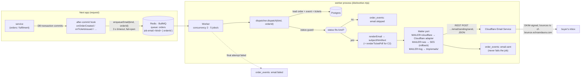

# Email — how a message gets from an order to an inbox

Status: ACTIVE · Owner: Evan · Last updated: 2026-10-04

Five kinds of email leave the system, all transactional, all sent by the
**worker** process through **Cloudflare Email Service** (ADR-057; Amazon
SES is the rollback, `MAILER=ses`). The Next app never talks to a
provider: it writes a job to Redis after the database commit, and the
worker does the rest. This page is the whole path, the failure modes, and
the "an email did not arrive" procedure. Setup is in
[../ENVIRONMENT.md](../ENVIRONMENT.md) § Email; DNS in
[../infra/CLOUDFLARE.md](../infra/CLOUDFLARE.md); the decision records are
ADR-057 (provider) and ADR-016 (the port and the queue), with ADR-014 for
the hooks and ADR-017 for the sign-in link.

**Tracing one email:** every send carries our own id in the
`X-Echoandaura-Id` header. The same id is in the worker log (`email sent`)
and in the order's audit note (`tickets-issued → buyer@… · <id>`). In
Gmail: ⋮ → Show original, search for the id.

---

## The five emails

| Kind (`EmailKind`)     | Design | Trigger (after-commit hook in `src/server/container.ts`)                       | Sent only if order is                                       | Attachment       | Template                             |
| ---------------------- | ------ | ------------------------------------------------------------------------------ | ----------------------------------------------------------- | ---------------- | ------------------------------------ |
| `payment-instructions` | C1     | `onOrderCreated` — registration committed                                      | `pending_payment` / `pending_verification`, hold not lapsed | —                | `templates/payment-instructions.tsx` |
| `tickets-issued`       | C2     | `onTicketsIssued` — admin approved; `onTicketsResendRequested` — admin re-send | `issued`                                                    | tickets PDF (C5) | `templates/tickets-issued.tsx`       |
| `rejected`             | C3     | `onOrderRejected` — admin rejected                                             | `rejected`                                                  | —                | `templates/rejected.tsx`             |
| `expired`              | C4     | `onOrderExpired` — the worker's `expire-holds` job (every 60 s, `holds` queue) | `expired`                                                   | —                | `templates/expired.tsx`              |
| sign-in link           | C6     | better-auth `magicLink` plugin → `sendMagicLink` → `enqueueSignInEmail`        | n/a (no order; skipped for admin emails)                    | —                | `templates/sign-in.tsx`              |

C3 and C4 tell the buyer whether the ticket type is still available.
They print the count ("4 General tickets") only when the event shows its
counts; an event with "Hide how many tickets are left" on gets the same
line without a number (`v.event.hideAvailability`, ADR-055).

Every template is React Email (`src/server/email/templates/`), rendered
to HTML **and** plain text. `pnpm email:render` writes all of them to
`tmp/emails/` from sample data for eyeballing.

## The pipeline


```mermaid
flowchart LR
  subgraph app["Next app (request)"]
    svc["service\n(orders / fulfilment)"] -->|"DB transaction commits"| hook["after-commit hook\nonOrderCreated / onTicketsIssued / …"]
    hook -->|"enqueueEmail(kind, orderId)\n3 s timeout, fail-open"| redis[("Redis · BullMQ\nqueue: orders\njob email.&lt;kind&gt; { orderId }")]
  end
  subgraph worker["worker process (dist/worker.mjs)"]
    redis --> w["Worker\nconcurrency 2 · 5 jobs/s"]
    w --> disp["dispatcher.dispatch(kind, orderId)"]
    disp -->|"load order + event + tickets"| pg[("Postgres")]
    disp -->|"status guard"| skip{{"status fits kind?"}}
    skip -- no --> auditskip["order_events: email.skipped"]
    skip -- yes --> render["renderEmail → subject/html/text\n(+ renderTicketPdf for C2)"]
    render --> mailer["Mailer port\nMAILER=cloudflare → Cloudflare adapter\nMAILER=ses → SES (rollback)\nMAILER=log → tmp/emails/"]
    mailer -->|"REST POST …/email/sending/send, JSON"| ses["Cloudflare Email Service"]
    mailer --> auditsent["order_events: email.sent\n(never fails the job)"]
  end
  ses -->|"DKIM-signed, bounces to cf-bounce.echoandaura.com"| inbox["buyer's inbox"]
  w -. "final attempt failed" .-> auditfail["order_events: email.failed"]
```

Step by step:

1. **A service commits.** Order creation, approve, reject and expiry each
   run one DB transaction. Nothing network-bound happens inside it
   (Invariant 7).
2. **The after-commit hook enqueues.** `enqueueEmail` puts
   `email.<kind>` with `{ orderId }` on the BullMQ queue `orders`. The
   **job id is deterministic** (`<kind>__<orderId>`), so a double hook or
   a retried request collapses into one job; a re-send asks for a fresh id
   with a timestamp. The producer's Redis connection fails fast (2 s
   connect, no offline queue) and the call is raced against a 3 s timeout:
   **if Redis is down the order still stands** and the hook logs an error —
   the admin can re-send later.
3. **The worker picks it up** (`src/worker.ts`, bundled with esbuild to
   `dist/worker.mjs`, run by plain `node` — `pnpm worker`). Concurrency 2,
   rate-limited to 5 jobs/s. Cloudflare's daily quota for a new account is
   unpublished and grows with good sending; past it, sends are throttled and
   retried (dashboard: Compute → Email Service).
4. **The dispatcher** (`src/server/email/dispatch.ts`) loads the order and
   applies the **status guard**: C1 only for an order still awaiting money
   (and not past its hold deadline — the 20-minute clock, not the 2-minute
   grace — so a C1 throttled behind a rush can be skipped once the clock
   has run out), C2 only for `issued`, etc. C4 goes to every abandoned
   checkout, about 22 minutes after it was placed (ADR-054). Anything
   else writes `email.skipped` and returns — a stale job can never send a
   misleading email. It then renders the template, attaches the PDF for
   C2, and hands an `OutgoingEmail` to the mailer.
5. **The Mailer port** (`src/server/email/mailer.ts`) has three adapters,
   chosen by `MAILER` (`select.ts`): `cloudflare` POSTs JSON (the PDF in
   base64, From as `{ address, name }`, our id in `X-Echoandaura-Id`, 20 s
   timeout); `ses` (the rollback) builds raw MIME with nodemailer's
   MailComposer and calls SESv2 `SendEmail`; `log` writes
   `.html`/`.txt`/attachments to `tmp/emails/`. Production **refuses**
   `log`.
6. **Audit.** After a successful send the dispatcher inserts
   `order_events` row `email.sent` (`<kind> → <address> · <id>`; with
   Cloudflare the id is ours, `(queued)` when Cloudflare queued it).
   That insert is wrapped so a DB hiccup after the send cannot fail the
   job — a retry would send twice.
7. **Cloudflare → inbox.** Cloudflare signs with DKIM for
   `echoandaura.com`, uses `cf-bounce.echoandaura.com` as the envelope
   sender, and the receiving side checks DKIM/SPF/DMARC against the DNS
   records in CLOUDFLARE.md.

The sign-in link (C6) takes the same road with job name `auth.sign-in`
and `{ to, url }`, no order, no audit row (only a log line), and
`removeOnComplete: true` because the URL is a bearer token.

### Retries and errors

| What Cloudflare says (ADR-057)                                               | Adapter throws         | Worker does                                                    |
| ---------------------------------------------------------------------------- | ---------------------- | -------------------------------------------------------------- |
| 429 / code 10004                                                             | `MailerThrottledError` | retry: 5 attempts, exponential backoff 30 s → 60 s → 2 → 4 min |
| 10001 bad schema, 10200 too big, 10201, 10202 invalid; a permanent bounce    | `MailerPermanentError` | `UnrecoverableError` — no retry, `email.failed` audit row      |
| 401/403 token or permission, 404, 5xx, a network failure or the 20 s timeout | a plain error          | retry as above (fix the token in time and it still goes)       |

The SES rollback maps its own names the same way (`ses-mailer.ts`).
| order status no longer fits | `EmailSkippedError` | job completes with `{ skipped }`, `email.skipped` audit row |

`email.failed` is written by the worker's `failed` listener on the
**final** attempt only, so the order page's audit trail shows one line
per outcome, not one per retry.

## Configuration

| Variable                                                               | Where        | Notes                                                                                   |
| ---------------------------------------------------------------------- | ------------ | --------------------------------------------------------------------------------------- |
| `MAILER`                                                               | worker       | `cloudflare` in production (`ses` = rollback; `log` refused); `log` locally and in e2e  |
| `CLOUDFLARE_ACCOUNT_ID`, `CLOUDFLARE_EMAIL_API_TOKEN`                  | worker       | the account id and a token with Email Sending: Edit only                                |
| `AWS_SES_REGION`, `AWS_SES_ACCESS_KEY_ID`, `AWS_SES_SECRET_ACCESS_KEY` | worker       | rollback only — [AWS.md](../infra/AWS.md#principals)                                    |
| `EMAIL_FROM`                                                           | worker       | `echoandaura <tickets@echoandaura.com>` — display name must stay ASCII (SESv2 envelope) |
| `EMAIL_REPLY_TO`                                                       | worker       | `hello@echoandaura.com` → Cloudflare Email Routing → organizer's Gmail                  |
| `SITE_URL`                                                             | worker       | every link in every email                                                               |
| `BKASH_RECEIVE_NUMBER`, `ORGANIZER_CONTACT_EMAIL`, `ORGANIZER_PHONE`   | worker       | copy inside the emails                                                                  |
| `REDIS_URL`                                                            | app + worker | the queue                                                                               |

The worker reads its own `.env`; the app and the worker may run on
different hosts as long as both see the same Redis and Postgres.

## Local development and tests

- `MAILER=log` (default when `NODE_ENV` ≠ production): every "send" is a
  file in `tmp/emails/`. Run `pnpm worker` next to `pnpm dev` to see the
  jobs drain; without the worker, jobs simply wait in Redis.
- `pnpm email:render` renders all templates with fixture data.
- `pnpm email:test <address>` sends one real message through whatever
  `MAILER` is set to — the provider smoke test.
- Unit tests cover the dispatcher (status guard, audit, skip), the
  adapters, and the templates (`tests/unit/email-*.test.ts`,
  `cloudflare-mailer.test.ts`, `ses-mailer.test.ts`). Playwright runs the app with `MAILER=log`.

## Debugging: "the buyer says no email arrived"

Work down; stop at the first hit.

1. **The order's audit trail** (`/admin/orders/<id>`, or
   `select * from order_events where order_id = … order by created_at`).
   - `email.sent … · <id>` → the provider accepted it. Go to step 5.
   - `email.skipped` → the order's status did not fit when the job ran
     (e.g. approved-then-cancelled). Expected; re-send if appropriate.
   - `email.failed: <reason>` → read the reason: `bounced permanently` =
     the address does not exist (ask the buyer for another, edit, re-send);
     `401`/`403` = the token in Dokploy (SECRETS.md); `10203` = sending
     disabled on the account (Cloudflare dashboard).
   - **nothing at all** → the job never ran or never existed. Step 2.
2. **Is the worker running?** Its log says `worker started` and, every
   minute, the expiry run. Not running → start it; queued jobs are still
   in Redis and will send when it comes up.
3. **Did the job get enqueued?** App log line `onOrderCreated hook failed`
   / `enqueue … timed out` means Redis was unreachable at commit time.
   The order is fine; use **Re-send tickets email** on the order page
   (C2) or ask the buyer to open their order page (C1's content is there
   too).
4. **Queue state:** BullMQ keys live under `bull:orders:*` in Redis;
   `failed` and `delayed` sets show retries in progress. A job stuck in
   `delayed` for minutes is being throttled — check the daily quota in
   Compute → Email Service.
5. **Accepted but nothing in the inbox:** Compute → Email Service → the
   activity and analytics views show delivered, bounced and queued counts
   (search by recipient). Then have the buyer check
   spam and search for `tickets@echoandaura.com`. If mail to Gmail lands
   in spam, verify DKIM/SPF/DMARC with `pnpm infra:check` and, in Gmail,
   _Show original_ on a test message.
6. **Running on the SES rollback?** SES is still in its sandbox: only
   verified addresses receive anything (AWS.md).

## Adding a new email kind

1. `src/server/email/templates/<kind>.tsx` — `subject(v)` and the
   component, using `EmailView`.
2. Add the kind to `EmailKind` / `EMAIL_KINDS` and `TEMPLATES` in
   `templates/render.ts`; add its allowed statuses to `SENDABLE` in
   `dispatch.ts` (the status guard is what stops stale sends).
3. A hook in the service that owns the state change, wired in
   `container.ts` to `enqueueEmail('<kind>', orderId)` — after commit,
   never inside the transaction.
4. Tests: template renders (`email-templates.test.ts`), dispatcher
   allows/skips (`email-dispatch.test.ts`), the service calls the hook.
5. `pnpm email:render` to look at it; add the row to the table at the top
   of this page.

## Verify

```bash
MAILER=cloudflare pnpm email:test <address>   # "cloudflare accepted the message: <id>"
pnpm infra:check                              # DNS rows green
```

and in Gmail, ⋮ → _Show original_ on the test message: `SPF: PASS`,
`DKIM: PASS` (`echoandaura.com`), `DMARC: PASS`.
